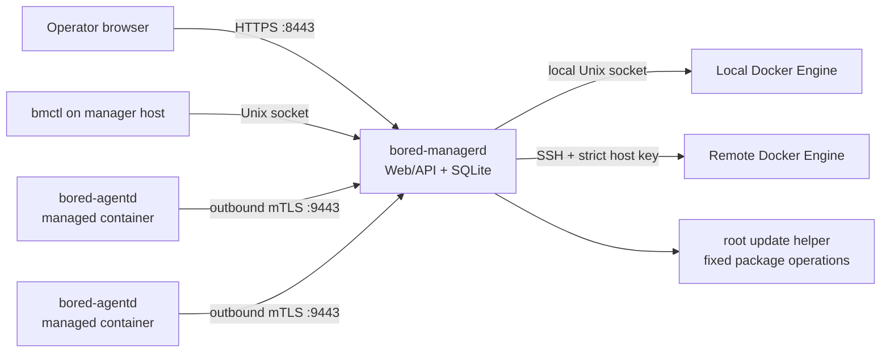

# Bored Manager

> **Development status:** Bored Manager is an early, pre-release implementation. There is no
> supported GitHub Release and the one-line installer is **not yet available for production
> use**. The installer checked into this repository intentionally fails closed until the real
> offline release public key is embedded by the release process. `main` documents the next
> development release; a release tag freezes the documentation for that release.

Vietnamese operator guide: [docs/README.MD](docs/README.MD). The English README remains the
canonical reference when the two translations differ.

Bored Manager is a small, self-hosted control plane for operating service-oriented Ubuntu 24.04
LTS and Kali Linux Rolling containers across one or more Docker hosts. It combines inventory,
service health, durable
actions, terminal access, provisioning, networking, and controlled updates in one LAN-oriented
Web application. It is intended for operators who need to manage many conventional systemd
services without introducing Kubernetes, Docker Swarm, PostgreSQL, Redis, or a separate message
broker.

The design target is 1,000 connected agents with up to 20 monitored services per agent. That
target is not a statement about the current pre-release build. A stable `v1.0.0` will not be
published until the scale, recovery, security, update, and purge gates in [PLAN.md](PLAN.md) pass.
Both release workflows enforce this with a tag/commit-bound certification record; no such record
exists today, so stable publication fails closed.

## Project overview

### What the project will provide

- A central `bored-managerd` control plane, SQLite database, Web UI, REST API, live event feed,
  and agent endpoint.
- A root `bored-agentd` inside each managed Ubuntu or Kali container. The agent opens an outbound mTLS
  connection and does not expose a control port.
- Local Docker Engine access over `/var/run/docker.sock`, only after an explicit root-equivalent
  permission warning.
- Remote Docker Engine access through SSH with strict host-key verification and an SSH tunnel to
  the remote Unix socket. Unauthenticated Docker TCP is never used.
- Versioned service definitions, health checks, typed service actions, alerts, durable batch
  jobs, interactive terminals, image templates, provisioning, and managed network allocations.
- Signed package updates, online SQLite backup, rollback, non-destructive package removal, and
  an ownership-checked purge workflow.

Features in this list are the v1 target. Check the release notes for the exact feature set of a
pre-release build.

### Architecture



The manager is the single writer of authoritative state. The v1 protocol reserves separate
control, shell, and artifact services so a large terminal transfer cannot starve heartbeats. The
current pre-alpha runtime implements the enrollment/heartbeat slice and a signed, manager-cached
HTTPS bootstrap artifact endpoint on the dedicated TLS agent listener; the separate gRPC shell and
artifact streams are contract-only and cannot yet be enabled. REST snapshots
include an event cursor; clients that miss an event range are told to resynchronize instead of
displaying silently stale state.

### Supported and unsupported platforms

The v1 certification target is deliberately narrow:

- Manager: Ubuntu Desktop 24.04 LTS or Kali Linux Rolling, amd64, systemd.
- Managed containers and Docker hosts: Ubuntu 24.04 LTS or Kali Linux Rolling, amd64, cgroup v2.
- Docker Engine: rootful Engine 28.5.1 or newer; reference certification uses 29.6.2.
- Browser: a current Firefox, Chromium, Chrome, or Edge release with JavaScript enabled.

Kali is identified by the exact `/etc/os-release` pair `ID=kali` and
`VERSION_CODENAME=kali-rolling`; its numeric `VERSION_ID` changes as the distribution advances.
Either the official `kali-rolling` suite or the safer frozen `kali-last-snapshot` suite is
supported. A host must use one suite consistently; mixed Ubuntu, Debian, multiple Kali-suite, or
third-party distribution repositories are unsupported. Certification records the actual suite,
point-release metadata, and package snapshot because `/etc/os-release` alone cannot distinguish
the two supported Kali suites.

The following are not supported in v1: ARM, distributions other than Ubuntu 24.04 LTS and Kali
Linux Rolling, rootless Docker, Docker Desktop as a production host, Kubernetes, Docker Swarm,
LXD, high-availability managers, Docker-in-Docker by default, automatic Docker installation, and
public Internet exposure without an operator-managed reverse proxy and certificate. Bored Manager
does not provide a DHCP plugin; an external plugin must pass the compatibility gate before DHCP
mode is enabled.

## Requirements

### Manager host

Minimum development/lab sizing is 2 CPU cores, 4 GiB RAM, and 20 GiB free SSD space. A useful
starting point for hundreds of agents is 4 CPU cores, 8 GiB RAM, and 50 GiB free SSD space. Size
for retained command output, artifacts, images, and backups. The v1 SQLite policy sets a 10 GiB
default quota, accelerates cleanup at 80%, and rejects new noncritical output at 90%. The current
pre-alpha exposes that limit in configuration and diagnostics but does not yet run the retention
worker or reject writes; operators must monitor database and WAL size until the lifecycle gate
declares quota enforcement available.

The host must have:

- Ubuntu Desktop 24.04 LTS or Kali Linux Rolling on amd64, with systemd, `sudo`, `curl`, OpenSSL,
  Python 3, and dpkg tools.
- Reliable LAN or VPN routing to managed containers and remote Docker hosts.
- Working DNS or stable addresses and synchronized time.
- Outbound HTTPS to GitHub Releases for manager updates, unless releases are mirrored.
- SSH access from the manager to every remote Docker host.

Default listeners are:

| Port/path | Direction | Purpose |
| --- | --- | --- |
| TCP 8443 | Browser to manager | HTTPS Web UI and REST/WebSocket API |
| TCP 9443 | Agent to manager | Agent mTLS endpoint |
| TCP 22 | Manager to remote host | SSH tunnel to remote Docker Unix socket |
| `/run/bored-manager/manager.sock` | Local only | Privileged local CLI/health operations |
| `/var/run/docker.sock` | Manager to local Engine | Optional local Docker connector |

Ports are configurable after setup. Do not open 8443 or 9443 to the public Internet by default.
The setup listener initially binds only to `127.0.0.1`.

### Docker permission warning

Membership in the Docker socket's group is effectively root access: a process can mount the host
filesystem or start a privileged container through the Docker API. The installer never changes
the socket to mode `0666`, never enables `tcp://2375`, never installs Docker, and never edits the
firewall. If local Docker is accepted, a systemd drop-in grants only the manager service the
socket's group. Reject local registration if that trust is not acceptable.

### TLS behavior

The initial Web UI uses a locally generated certificate. A browser warning is expected until an
operator-trusted certificate or reverse proxy is configured. Compare the fingerprint printed by
the installer with `sudo bmctl diagnostics` before accepting the certificate. Agent transport uses a
separate private CA and mTLS; accepting the Web UI certificate does not enroll an agent.

## Quick installation

### Release availability check

There is currently no supported release. Confirm that the repository's
[Releases page](https://github.com/FireStarsSoft/Bored-Manager/releases) contains a published,
non-draft release whose notes explicitly identify it as installer-enabled. Its **Assets** list must
contain `install-manager.sh`, `install-agent.sh`, `release-manifest-v1.json`,
`release-manifest-v1.json.sig`, `SHA256SUMS`, `SHA256SUMS.sig`, both versioned `.deb` packages, the
SPDX SBOM, and the provenance bundle. GitHub's automatically generated source archives do not count
as release assets. Do not run the command against `main`, a pull-request artifact, an empty/source-
only release, or an unsigned asset.

### One-line manager installation

After the first signed stable, non-prerelease release is published and selected by GitHub as
**Latest**, the official command will be:

```bash
tmp="$(mktemp)" && { curl --proto '=https' --proto-redir '=https' --tlsv1.2 -fL --retry 3 -o "$tmp" https://github.com/FireStarsSoft/Bored-Manager/releases/latest/download/install-manager.sh && bash "$tmp"; rc=$?; rm -f "$tmp"; (exit "$rc"); }
```

GitHub's `/releases/latest/` alias does not select prereleases. For an installer-enabled
prerelease, use its exact `vX.Y.Z-suffix` tag and the checksum-pinned procedure below; never replace
the tag-specific URL with `/latest/`.

The bootstrap runs as the current user. It downloads the signed manifest, checks the embedded
release-key fingerprint, verifies the manifest and checksums, validates both Debian packages,
and only then asks for `sudo`. It installs the manager package and caches the matching verified
agent installer and package. It does not execute an unverified network response.

Expected successful output includes the verified release version, package hashes, systemd health,
Web UI URL, HTTPS fingerprint, and whether a local Docker host was registered. If Docker is
absent, stopped, rootless, or inaccessible, manager installation still completes and no broken
host record is created.

Useful installer switches are:

```text
--dry-run                     inspect and verify without changing the host
--version X.Y.Z               install an exact release
--no-start                    install but do not start services
--skip-local-docker           never offer local Docker registration
--accept-local-docker-risk    non-interactive acknowledgement of root-equivalent access
--allow-downgrade             acknowledge downgrade intent; transition still requires updater
```

### Version-pinned, checksum-pinned bootstrap

For controlled environments, first obtain the release public-key fingerprint through an
independent trusted channel, verify the downloaded manifest's Ed25519 signature, and only then copy
the installer SHA-256 from that manifest. Substitute the actual release tag and digest below. Keep
the quotes.

```bash
release_tag="vX.Y.Z"
installer_sha256="REPLACE_WITH_64_HEX_CHARACTERS_FROM_SIGNED_MANIFEST"
installer="$(mktemp)"
curl --proto '=https' --proto-redir '=https' --tlsv1.2 -fL --retry 3 \
  -o "$installer" \
  "https://github.com/FireStarsSoft/Bored-Manager/releases/download/${release_tag}/install-manager.sh"
printf '%s  %s\n' "$installer_sha256" "$installer" | sha256sum --check --strict
bash "$installer" --version "${release_tag#v}"
rc=$?
rm -f "$installer"
exit "$rc"
```

This outer checksum protects against accidentally using the wrong installer. The installer's
embedded Ed25519 trust root still authenticates the release manifest and package set.

## First-run setup

This workflow becomes available in the first installer-enabled alpha. Until then, use only the
development workflow later in this document.

1. Open the loopback setup URL printed by the installer, normally
   `https://127.0.0.1:8443/setup`.
2. Compare the displayed certificate fingerprint with the installer output. Do not continue if
   they differ.
3. Create the first administrator with a unique password stored in a password manager. Setup is
   single-use; subsequent attempts must return an authorization error.
4. Choose the LAN/VPN bind address and confirm that ports 8443 and 9443 do not collide. Keep
   loopback-only mode if remote browsers and agents are not ready. The unprivileged packaged service
   accepts only ports 1024 through 65535.
5. Review local Docker detection. The UI can register the socket only when it is already accessible
   to `bored-managerd`; OS group access must first be granted by the verified installer or the
   reviewed host workflow. Otherwise skip it and add the host later.
6. Save. If the listener changed, setup displays a manual restart command because the unprivileged
   manager cannot restart its own systemd unit. Run the restart and health commands shown on-screen,
   reconnect at the real LAN/VPN address, compare the certificate fingerprint again, and sign in.
   A loopback session cookie is not reused on a new origin.
7. Validate local health and boot persistence:

```bash
bmctl version
sudo bmctl health
bmctl open-ui
systemctl is-enabled bored-managerd.service
systemctl is-active bored-managerd.service
sudo systemctl restart bored-managerd.service
sudo bmctl health
```

If local Docker permission was accepted but its host record must be recreated, first verify the
systemd Docker-group drop-in and then use the local control socket:

```bash
sudo bmctl docker-host add-local --name local --socket /var/run/docker.sock \
  --confirmation "I UNDERSTAND DOCKER ACCESS IS ROOT-EQUIVALENT"
```

Do not expose a temporary unauthenticated TCP health endpoint or change the Docker socket mode.

## Agent installation and enrollment

Agent enrollment is under development and is not yet a supported installation path. The final
flow contains no bearer enrollment token in the command line, environment, or shell history.

1. In the Web UI, open **Agents → Add agent**, select the exact manager-compatible version, and
   enter the manager URL.
2. Compare the UI's CA/SPKI pin with the value shown on the target console.
3. Run the exact-version command generated by the UI. It downloads `install-agent.sh` using an
   exact TLS SPKI pin, then verifies the offline-signed manifest and `bored-manager-agent` package.
   On a self-signed bootstrap endpoint, public-CA chain validation is deliberately replaced by
   that independently compared pin; the installer never accepts an unpinned TLS connection.
4. The agent generates its private key and CSR locally. Its private key never reaches the manager.
5. Open **Agents → Pending approval**. Compare the CSR SHA-256 fingerprint and short verification
   code shown in both places. Re-authenticate, then approve or reject.
6. Approval requests expire after 10 minutes. If one expires, rerun enrollment to create a new
   request; never extend or reuse an expired challenge.

The package can be inspected without changing a target once a release exists:

```bash
bash install-agent.sh --manager-url "https://manager.example.invalid:9443" \
  --manager-spki-pin "sha256//BASE64_SPKI_PIN_FROM_MANAGER" \
  --version "X.Y.Z" --dry-run
```

To reject a request, use the pending-approval screen. To replace a damaged or cloned identity,
remove `/var/lib/bored-manager-agent` only through the future `bmctl agent reset-identity` recovery
workflow; direct file deletion can orphan audit records. A reset creates a new agent UUID and key
and links it to the superseded enrollment.

The current pre-alpha revocation API requires recent administrator reauthentication, a recorded
reason, exact `REVOKE <agent UUID>` confirmation, CSRF validation, and an idempotency key. A revoked
certificate is rejected on the next HTTPS heartbeat. Immediate closure of an already-open control
stream remains a v1 gate because the pre-alpha transport does not yet maintain that gRPC stream.

Manager-initiated provisioning does not bake credentials into an image. It uses a one-time,
pre-approved challenge bound to the provision job, logical instance, and exact image digest. The
challenge is passed through tmpfs/stdin and becomes invalid after first use or expiration.

## Daily operation

Only the basic binary/version/health surface is expected during early development. Commands below
that are marked **planned** must not be automated until the release notes declare them available.

### Services and local diagnostics

```bash
sudo systemctl status bored-managerd.service --no-pager
sudo systemctl restart bored-managerd.service
sudo journalctl -u bored-managerd.service --since "30 minutes ago" --no-pager
bmctl version
sudo bmctl health
sudo bmctl diagnostics
```

On an agent container:

```bash
sudo systemctl status bored-agentd.service --no-pager
sudo systemctl restart bored-agentd.service
sudo journalctl -u bored-agentd.service --since "30 minutes ago" --no-pager
```

Use the Web UI for service inventory and desired state. A service has separate presence,
availability, runtime, and health fields; `absent`, `stopped`, and `unhealthy` are not equivalent.
Typed install/start/stop/restart/update actions create durable jobs and are safe to retry by their
idempotency key. Do not bypass a stuck job by editing SQLite.

### Remote Docker host onboarding (planned)

1. Record the host's SSH fingerprint through a trusted out-of-band channel.
2. Load the private key as a root-owned encrypted systemd credential named for that host. The Web
   API accepts only its credential reference; it never accepts private-key bytes.
3. In **Docker Hosts → Add**, enter name, address, SSH port/user, credential reference, exact
   `known_hosts` line, independently verified fingerprint, and socket path (normally
   `/var/run/docker.sock`).
4. Run preflight. A changed host key blocks the connection; there is no auto-accept override.
5. Resolve engine/API, cgroup v2, storage, DNS, route, address-pool, and port-collision findings.
6. Enable the host only after preflight passes.

On the manager host, preload a reviewed key without putting its contents in an argument,
environment variable, or database. Replace only the two path/name values:

```bash
credential_name='ssh-dockyard-03.key'
private_key_path='/root/offline-input/dockyard-03_ed25519'
[[ "$credential_name" =~ ^[A-Za-z0-9][A-Za-z0-9_.-]{0,127}$ ]] || exit 1
[[ "$private_key_path" == /* && -f "$private_key_path" && ! -L "$private_key_path" ]] || exit 1
sudo install -d -o root -g root -m 0700 /etc/credstore.encrypted
sudo systemd-creds encrypt --name="$credential_name" \
  "$private_key_path" "/etc/credstore.encrypted/${credential_name}"
drop_in="$(mktemp)"
printf '[Service]\nLoadCredentialEncrypted=%s\n' "$credential_name" >"$drop_in"
sudo install -d -o root -g root -m 0755 \
  /etc/systemd/system/bored-managerd.service.d
sudo install -o root -g root -m 0600 "$drop_in" \
  "/etc/systemd/system/bored-managerd.service.d/50-${credential_name}.conf"
rm -f "$drop_in"
sudo systemctl daemon-reload
sudo systemctl restart bored-managerd.service
sudo bmctl health
```

Delete or return the plaintext source key to its protected storage after verifying the encrypted
credential and recovery copy. Removing a Docker host profile does not delete a credential; remove
its drop-in and encrypted file only after confirming that no other host references the name.

### Dashboard, terminal, batch, and provisioning (planned)

- Filter by alias, UUID, host, tag, service, presence, runtime, or health. `resync_required`
  refreshes the snapshot and is not an error to ignore.
- Terminal sessions default to the locked-down `bored-shell` account. Root requires explicit
  re-authentication, a reason, and an audit event. Closing a terminal must terminate its PTY and
  descendants.
- Batch commands use prepare/ready/commit barriers and show per-target output. Cancellation is
  durable; targets that miss a lease must not start late.
- Provisioning uses immutable template revisions and image digests. Review preflight, reservations,
  selected services, and the ownership plan before commit.
- Bridge, static pool, macvlan, and ipvlan modes require a separate management bridge for reliable
  agent egress. DHCP remains disabled until an external plugin/version/digest is certified.

## Update and rollback

Updates are manual and package-based. There is no unattended stable-channel update in v1.

1. Read the release notes and compatibility range. Manager version N supports agent N and N-1.
2. Create and verify an online backup before staging any package.
3. Let the manager fetch the signed release once and cache exact artifacts. Agents do not download
   releases directly from the Internet.
4. Update a small canary set, then proceed in waves. Rollout stops if failure exceeds 2%, agents do
   not reconnect within 45 seconds, or crash/check errors rise unexpectedly.
5. Update the manager only after artifacts, backup metadata, disk space, and schema migration are
   validated.

The current update-helper foundation accepts only fixed local package operations over a
root-owned Unix socket, checks peer credentials, and re-verifies a staged package. It cannot
receive an arbitrary URL or shell command. Health orchestration, migration markers, automatic
N-1 reinstall, and matching-backup restoration are still blocked on lifecycle acceptance tests;
no pre-alpha release may advertise automatic rollback. Once that gate passes, `bmctl version`
and `dpkg-query` must agree:

```bash
bmctl version
dpkg-query -W -f='${Version}\n' bored-manager
sudo journalctl -u bored-managerd.service -u bored-update-helper.service \
  --since "30 minutes ago" --no-pager
```

Until the update CLI is released, do not manually install a newer database-writing binary over an
existing state directory. See [the release runbook](docs/runbooks/release.md).

## Backup and disaster recovery

The planned default is one online backup per day with seven retained copies. A valid backup set
contains the SQLite online-backup image, configuration, schema/version metadata, release metadata,
and an encrypted CA export. A database file copied while the service is writing is not a supported
backup.

Operator procedure:

1. Record `bmctl version`, free disk space, and current health from `sudo bmctl health`.
2. Use the backup command supplied by the installed release; store the archive outside
   `/var/lib/bored-manager` and test its integrity.
3. Export CA material with a new, high-entropy passphrase to offline storage. Never place that
   passphrase in shell history or a process argument.
4. Restore only into an equal or explicitly compatible manager version.
5. Stop the manager, preserve the damaged state directory, restore through `bmctl`, start, and
   validate database integrity, schema version, certificate chain, agents, jobs, and audit history.

If the database is damaged but CA state is intact, restore the latest verified backup and allow
agents to reconnect. If the CA private key is lost, agents cannot be silently reissued: recover the
encrypted CA backup or perform a controlled CA reset and re-enroll every agent. Never generate a
new CA under the old name and treat it as equivalent.

Exact pre-release commands and rollback points are maintained in
[the backup/restore runbook](docs/runbooks/backup-restore.md).

## Remove and purge

`apt remove bored-manager` stops/disables package units and removes dpkg-owned programs. It keeps
configuration, state, backups, cached artifacts, users, and every Docker resource. Removing the
agent never removes monitored services.

Purge is a separate, explicit ownership workflow. The future `bmctl purge` wizard exports an
inventory first and asks independently whether to delete:

- manager database/configuration/CA and backups;
- cached release artifacts and derived images owned by Bored Manager;
- agent state and identity;
- managed containers;
- managed networks and IP/MAC reservations;
- managed volumes;
- the certified DHCP plugin.

Each destructive selection requires a typed confirmation. Docker objects are eligible only when
their `io.firestarssoft.bored-manager.*` labels and database ownership record agree. A label alone,
a name prefix, or an orphaned database row is insufficient. Normal package removal and `apt purge`
must not infer permission to delete user Docker resources.

After purge, verify no selected unit, process, listener, socket, lock, staging file, or owned Docker
object remains. Keep the exported ownership manifest with the audit record. Follow
[the remove/purge runbook](docs/runbooks/remove-purge.md); do not approximate it with `rm -rf`.

## Configuration reference

The final configuration schema is contract-controlled and may change before the first alpha. The
package reserves these stable locations:

| Item | Default |
| --- | --- |
| Optional manager JSON configuration | `/etc/bored-manager/manager.json` |
| Optional agent JSON configuration | `/etc/bored-manager/agent.json` |
| Manager state/SQLite | `/var/lib/bored-manager` |
| Agent identity/state | `/var/lib/bored-manager-agent` |
| Release/artifact cache | `/var/cache/bored-manager` |
| Runtime sockets | `/run/bored-manager` |
| Manager service account | `bored-manager` |
| Default agent terminal account | `bored-shell` |
| Web/API listener | `127.0.0.1:8443` during setup; configured address afterward |
| Agent listener | configured address on TCP 9443 |
| Service check interval | 30 seconds by default; state visible within 60 seconds |
| Raw metric sample | 15 seconds in memory |
| Persistent metric aggregates | 1 minute and 15 minutes |
| SQLite quota | v1 policy: 10 GiB with retention pressure at 80%/90%; pre-alpha enforcement is unavailable |
| Backups | daily, seven copies by default |
| Update channel | manual stable/pre-release selection |

The packaged units read optional root-owned environment files from `/etc/default/bored-manager`,
`/etc/default/bored-manager-agent`, and `/etc/bored-manager/agent.env`. JSON is used only when
`BORED_MANAGER_CONFIG` or `BORED_AGENT_CONFIG` points to a reviewed file. Environment values take
precedence over JSON.

| Manager variable | Meaning/default |
| --- | --- |
| `BORED_MANAGER_CONFIG` | Optional JSON configuration path; unset by default |
| `BORED_MANAGER_BIND` | Listener address; `127.0.0.1` before authenticated setup |
| `BORED_MANAGER_WEB_PORT` / `BORED_MANAGER_AGENT_PORT` | HTTPS 8443 / agent 9443; distinct unprivileged ports 1024–65535 |
| `BORED_MANAGER_STATE_DIR` / `BORED_MANAGER_CACHE_DIR` | State and verified artifact roots shown above |
| `BORED_MANAGER_RUNTIME_DIR` | Runtime/socket directory, `/run/bored-manager` |
| `BORED_MANAGER_WEB_DIR` | Built SPA, `/usr/share/bored-manager/web` |
| `BORED_MANAGER_DATABASE` | SQLite path, `/var/lib/bored-manager/manager.db` |
| `BORED_MANAGER_WEB_CERT` / `BORED_MANAGER_WEB_KEY` | Web certificate/private-key paths below manager state |
| `BORED_MANAGER_AGENT_CA` / `BORED_MANAGER_AGENT_CA_KEY` | Agent CA certificate/key; packaged operation requires the private key through the `agent-ca.key` encrypted systemd credential |
| `CREDENTIALS_DIRECTORY` | Read-only path set by systemd for decrypted CA/SSH credentials; operators must not set or override it manually |
| `BORED_MANAGER_SESSION_IDLE` / `BORED_MANAGER_SESSION_LIFETIME` | Go duration strings; defaults 30 minutes / 12 hours |
| `BORED_MANAGER_DATABASE_LIMIT` | Database limit in bytes; default 10 GiB; diagnostics-only in the current pre-alpha |
| `BORED_MANAGER_EVENT_BUFFER` | Bounded live-event buffer; 16–4,095 entries, default 1,024 |
| `BORED_MANAGER_DEV_HTTP` | Development-only plaintext mode; must remain false in packaged operation |

| Agent variable | Meaning/default |
| --- | --- |
| `BORED_AGENT_CONFIG` | Optional root-owned JSON configuration path |
| `BORED_AGENT_MANAGER_URL` | Required manager HTTPS URL |
| `BORED_AGENT_MANAGER_SPKI_PIN` | Required `sha256//...` public-key pin |
| `BORED_AGENT_NAME` | Displayed source name; defaults to container hostname |
| `BORED_AGENT_STATE_DIR` | Identity/state root, `/var/lib/bored-manager-agent` |
| `BORED_AGENT_CERT` / `BORED_AGENT_KEY` / `BORED_AGENT_CA` | Local identity and trust paths below agent state |
| `BORED_AGENT_HEARTBEAT` | Go duration from 5 seconds through 5 minutes; default 15 seconds |

While approval is pending, the agent stores only resumable request metadata in
`/var/lib/bored-manager-agent/pending-enrollment.json`; it never stores an enrollment bearer token.
The file is removed after approval, rejection, expiry, or identity reset.

Local `bmctl` accepts `BORED_MANAGER_SOCKET`, `BORED_MANAGER_URL`, and
`BORED_MANAGER_SPKI_PIN`. Do not use environment variables for private keys or passphrases.

Supported Docker network modes for v1 are user-defined bridge with dynamic IPAM, bridge with a
manager-owned static pool, macvlan/ipvlan L2 with a global pool, and external network/IPAM plugin
DHCP. The certified DHCP matrix is currently empty; DHCP must therefore remain disabled.

## Troubleshooting

Start with the least invasive evidence:

```bash
sudo bmctl health
bmctl version
sudo bmctl diagnostics
sudo journalctl -u bored-managerd.service --since "1 hour ago" --no-pager
sudo systemctl show bored-managerd.service \
  -p ActiveState -p SubState -p Result -p ExecMainStatus
df -h /var/lib/bored-manager /var/cache/bored-manager
```

Create the current redacted-by-construction diagnostic snapshot with a private umask. It contains
versions, counts, queue/database sizes, listener ports, and the public Web SPKI fingerprint; it
does not contain cookies, credentials, keys, enrollment challenges, terminal input, agent names,
or command output:

```bash
umask 077
support_dir="$(mktemp -d)"
sudo bmctl diagnostics >"${support_dir}/diagnostics.json"
systemctl show bored-managerd.service \
  -p ActiveState -p SubState -p Result -p ExecMainStatus \
  >"${support_dir}/systemd-state.txt"
dpkg-query -W -f='${Package} ${Version} ${Architecture}\n' \
  bored-manager bored-manager-agent 2>/dev/null \
  >"${support_dir}/packages.txt" || true
sha256sum "${support_dir}"/* >"${support_dir}/SHA256SUMS"
printf 'Review before sharing: %s\n' "$support_dir"
```

Journald is deliberately not included automatically because application errors can contain local
names or addresses. Inspect it with the commands above, copy only the needed time window, and
manually replace private names/addresses before sharing. Never add private keys, `agent.env`, the
SQLite database, browser cookies, terminal transcripts, or `/etc/bored-manager` to a bundle.

| Symptom | Diagnostic | Likely cause | Corrective action |
| --- | --- | --- | --- |
| Installer URL returns HTTP 404 | Inspect the selected release's **Assets** list and exact tag | No eligible stable **Latest** release, a prerelease was requested through `/latest/`, or `install-manager.sh` was never uploaded | Stop. For stable releases require the complete signed asset set; for prereleases use the exact tag-specific, checksum-pinned URL. Do not execute the raw template from `main`. |
| Installer signature/hash failure | Rerun with `--dry-run`; compare release tag and asset names | Tampered/truncated asset, wrong mirror, unsigned draft, or stale cache | Stop. Delete the temporary downloads, verify the published signing-key fingerprint through a second channel, and retry the exact release. Never use a skip-verification flag. |
| Unsupported OS/architecture | `source /etc/os-release; printf '%s %s %s\n' "$ID" "${VERSION_ID:-}" "${VERSION_CODENAME:-}"; dpkg --print-architecture` | Not Ubuntu 24.04/amd64 or Kali Rolling/amd64, or Kali uses a mixed/unsupported repository set | Use a certified host with one official suite, `kali-rolling` or `kali-last-snapshot`; do not override the check or mix Ubuntu, Debian, or multiple Kali suites. |
| Dpkg lock | `sudo fuser /var/lib/dpkg/lock-frontend` | apt/dpkg is active | Let the owning process finish. Do not delete lock files. Run `sudo dpkg --audit` afterward. |
| Insufficient disk | `df -h /var/lib/bored-manager /var/cache/bored-manager` | Package, backup, DB, or image cache exceeds free space | Remove unrelated data or expire verified cache entries through the manager; preserve the current package and rollback backup. |
| Manager will not start | `systemctl status` and `journalctl` commands above | Invalid config, permission, migration, missing credential, port collision | Restore the last valid config/package pair; do not edit SQLite. Check `ss -ltnp` for 8443/9443. |
| Setup page unavailable | Run `ss -ltnp` and inspect ports 8443/9443 | Loopback bind, service down, firewall, or collision | Open it locally first, validate health, then configure the intended LAN address and firewall explicitly. |
| Local Docker not detected | `test -S /var/run/docker.sock; stat -c '%A %U %G' /var/run/docker.sock` | Docker stopped, rootless socket, or manager lacks socket group | Start an already-installed rootful Engine or reject local integration. Rerun the installer registration step; never use `chmod 666`. |
| SSH host-key mismatch | `ssh-keygen -F docker-host.example.invalid` and an out-of-band fingerprint check | Host reinstalled, DNS/IP changed, or interception | Block access until the owner confirms the new key. Replace the pinned fingerprint only through an audited UI action. |
| SSH credential unavailable | `systemctl show bored-managerd.service -p LoadCredentialEncrypted`; inspect the credential drop-in name, not key contents | Missing encrypted file, misspelled reference, or manager not restarted after loading it | Restore the reviewed encrypted credential and matching drop-in, run `daemon-reload`, restart, and retry preflight. Never upload a private key to the API. |
| Agent stays pending | Compare console/UI CSR fingerprint and request age | Not approved, expired request, CA pin mismatch, or clock skew | Correct time/pin, reject the stale request, and create a fresh enrollment. Do not reuse a challenge. |
| Agent offline/stale | Agent journal plus manager connection history | Network/mTLS failure, revoked/expired certificate, manager restart | Validate route/time/chain and reason for revocation; re-enroll only when identity recovery is intentional. |
| Service false-green/unknown | Inspect last observation time and four-axis state | Agent stale, unsupported adapter, timeout, or old cached snapshot | Resynchronize, fix the check, and wait for a fresh observation. Never translate `unknown` to healthy. |
| Job stuck in leased/running | Inspect target lease, expiry, attempt, and agent journal | Lost connection, expired worker, or unclean child process | Cancel through the durable job API and allow lease recovery. Confirm PTY/child cleanup before retrying. |
| UI reports `resync_required` | Browser network log and manager event cursor | Client cursor fell outside retention or its buffer overflowed | Let the UI refetch a snapshot. Investigate repeated events as load/backpressure, not data corruption. |
| SQLite busy/WAL growth | `ls -lh /var/lib/bored-manager`; manager DB metrics | Long reader, writer pressure, checkpoint failure, or disk full | Stop heavy exports, free disk, capture diagnostics, then use the supported checkpoint/recovery command. Do not delete `-wal`/`-shm`. |
| Update rolled back | Helper/manager journals and update marker | Signature, package, migration, start, or 60-second health failure | Keep N-1 running, preserve failed artifacts/logs, and resolve the release defect before retrying. |
| macvlan/ipvlan target unreachable from host | Check management bridge and upstream VLAN/switch policy | Expected host isolation, wrong parent interface/VLAN, or duplicate address | Use the management bridge for agent control and correct L2/pool configuration. Do not add ad-hoc host routes without documenting ownership. |
| DHCP allocation fails | Plugin version/digest, plugin log, lease test | Missing/disabled/uncertified plugin or exhausted DHCP scope | Keep provisioning blocked, restore the certified plugin/digest, and rerun acquire/renew/release preflight. |

For a longer incident checklist, see [the troubleshooting runbook](docs/runbooks/troubleshooting.md).

## Security and trust model

The one-line bootstrap trusts HTTPS delivery of the installer from the project's GitHub repository.
The installer's embedded Ed25519 key then authenticates the manifest and checksums and validates
the exact package SHA-256, size, name, version, and architecture before `sudo` is used. The separate
release-promotion gate validates the SPDX SBOM and the signed Sigstore bundle containing GitHub
build provenance for both packages and both installers. The embedded key cannot
protect a user if the initial installer itself is maliciously replaced; high-assurance deployments
must independently verify the public-key fingerprint, manifest signature, and installer digest
before execution. GitHub artifact attestations are supplemental and do not replace offline
signatures.

Important trust boundaries:

- Docker socket access is root-equivalent.
- The agent runs as root to manage systemd services; interactive terminals default to
  `bored-shell`, and root terminal access is exceptional and audited.
- The manager runs as an unprivileged `bored-manager` user. A small root update helper performs
  only fixed, locally staged package operations after peer and artifact verification. It serializes
  operations and copies the verified regular file to a root-owned `PrivateTmp` inode before invoking
  `dpkg`, preventing a staging-path replacement from changing the installed bytes.
- Agent private keys are generated and remain on agents. The packaged manager loads its CA key and
  every SSH key through root-owned encrypted systemd credentials and never stores them in SQLite.
  Direct development binaries retain a state-file fallback solely for isolated tests and are not
  certified for production.
- SSH host-key changes, certificate revocation, destructive purge, and root terminal elevation
  fail closed and require explicit operator action.

Never report a vulnerability in a public issue. Follow [SECURITY.md](SECURITY.md).

## Development and contribution

### Windows 11 and WSL2 Ubuntu 24.04

Use WSL2 Ubuntu 24.04 for Go, Node, Bash, dpkg, systemd, and Docker-oriented development. Avoid
building release artifacts with the Windows toolchain. Kali Linux Rolling is a certified runtime
and package-installation target, not the reproducible release-build host.

From an elevated Windows PowerShell session, install/select the correct distribution (this does
not replace an existing distribution unless Windows explicitly asks):

```powershell
wsl --install -d Ubuntu-24.04
wsl --set-default Ubuntu-24.04
wsl --distribution Ubuntu-24.04
```

Inside Ubuntu, install base tools and the pinned Go/Node archives. The checksum files are fetched
from each upstream's official HTTPS distribution endpoint and must pass before extraction:

```bash
sudo apt-get update
sudo apt-get install -y build-essential ca-certificates curl git make shellcheck dpkg-dev xz-utils

go_archive="go1.26.5.linux-amd64.tar.gz"
curl --proto '=https' --tlsv1.2 -fLO "https://go.dev/dl/${go_archive}"
curl --proto '=https' --tlsv1.2 -fLO "https://go.dev/dl/${go_archive}.sha256"
go_sha256="$(tr -d '[:space:]' < "${go_archive}.sha256")"
printf '%s  %s\n' "$go_sha256" "$go_archive" | sha256sum --check --strict
sudo install -d -m 0755 /opt/go1.26.5
sudo tar -C /opt/go1.26.5 --strip-components=1 -xzf "$go_archive"

node_version="24.18.0"
node_archive="node-v${node_version}-linux-x64.tar.xz"
curl --proto '=https' --tlsv1.2 -fLO \
  "https://nodejs.org/dist/v${node_version}/${node_archive}"
curl --proto '=https' --tlsv1.2 -fLO \
  "https://nodejs.org/dist/v${node_version}/SHASUMS256.txt"
grep -F "  ${node_archive}" SHASUMS256.txt | sha256sum --check --strict
sudo install -d -m 0755 "/opt/node-v${node_version}"
sudo tar -C "/opt/node-v${node_version}" --strip-components=1 -xJf "$node_archive"

export PATH="/opt/go1.26.5/bin:/opt/node-v24.18.0/bin:${PATH}"
git clone https://github.com/FireStarsSoft/Bored-Manager.git
cd Bored-Manager
go version
node --version
npm --version
make test
make build
```

Pinned project toolchains are Go 1.26.5, Node 24.18.x, TypeScript 6.0.x, and React 19.2.x. Contract
generation pins ogen 1.23.0, Buf 1.72.0, the Protobuf Go plugins in `api/proto/buf.gen.yaml`, and
`@hey-api/openapi-ts` 0.99.0. Install the exact versions described by `go.mod`,
`package-lock.json`, and `web/package-lock.json`; never hand-edit a lockfile. `make generate`
updates the committed Go and
TypeScript clients from OpenAPI and the committed Go protocol bindings from Protobuf. CI rejects
generated drift.

Common tasks:

```bash
make generate
make lint
make test
make build
bash scripts/check-docs.sh
bash scripts/build-deb.sh --version 0.1.0-dev --architecture amd64
bash scripts/install-manager.sh --dry-run --version 0.1.0-dev
```

The last command intentionally fails at the release-signature gate until a release engineer
generates an installer with the production public key. This is a safety property, not an
installation workaround.

All public API changes begin in OpenAPI or Protobuf and pass compatibility checks. All database
changes use forward migrations and a tested backup/rollback path. New privileged operations need
a threat-model update and an ADR. Pull requests must include focused tests and documentation for
operator-visible behavior. See [CONTRIBUTING.md](CONTRIBUTING.md).

Releases are built as draft artifacts, signed offline, verified by a separate promotion job, and
published only after all required checks. Release engineering details are in
[docs/runbooks/release.md](docs/runbooks/release.md).

Bored Manager is licensed under the [Apache License 2.0](LICENSE).
