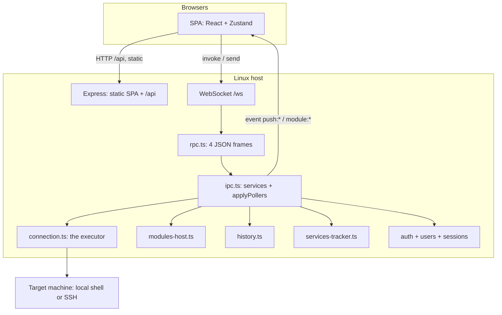

# Architecture

How Bored Manager is put together, and why. For the module system specifically, see [MODULES.md](MODULES.md). For writing a module, see [MODULE-RULESET.md](MODULE-RULESET.md).

## The idea

The app reimplements nothing. Everything it shows comes from tools that are already on the target machine (`/proc`, `ps`, `ss`, `ip`, `lsblk`, `df`, `dpkg`/`apt`, `nvidia-smi`, `docker`, `sensors`), read through a single executor that is either a local shell or an SSH session. The app's job is to batch those reads, diff the counters, and draw the result.

That is why "local machine" and "over SSH" are the same code path: one interface, two implementations.

The **server** runs on Linux. Every browser on the network talks to that one process. There is still **one** connected target and **one** set of terminals — connect or disconnect from any client affects the others. That is deliberate.

## Process layout



| File | Owns |
|---|---|
| `server/index.ts` | HTTP server, `/ws` upgrade, heartbeat ping/pong every 30s, `unlock` subcommand, SIGINT/SIGTERM → `cleanClose()` |
| `server/http.ts` | Express app: CSP, session cookie `bm.sid`, static `out/renderer/`, SPA fallback, `/api` router |
| `server/rpc.ts` | The four JSON frames, per-socket `activeTab` / `username` / `sessionId`, broadcast |
| `server/ipc.ts` | Every service instance, `registerRpc()`, and `applyPollers()` — the single place that decides what is running |
| `server/connection.ts` | The `ConnectionManager`: connect, disconnect, `exec` / `execSudo` / `stream` / `streamSudo`, the status the UI shows |
| `server/executors/local.ts`, `ssh.ts` | The two implementations. `ssh.ts` is imported lazily so a broken native binding can only affect a connect attempt, never startup |
| `server/session-registry.ts` | Everything that has to be released on close: pollers, log streams, terminals. `disposeAll()` on quit |
| `server/services/*` | The app's own collectors and services (see below) |
| `server/auth.ts` | Login, logout, lockout, session gate on `/api` |
| `modules/<id>/main/` | A module's main half, compiled at runtime to `modules/<id>/.dist/main.mjs` |
| `modules/<id>/ui/` | A module's page and widget JSON specs |
| `src/` | The renderer: React, Tailwind, Radix, recharts, react-grid-layout, xterm.js |
| `src/modules/` | `BlockRenderer` + binding: every module page is built from specs, not from React the module shipped |
| `shared/` | Types and pure helpers used by the server **and** by modules |

## What the app itself collects

| Service | Reads | Emits |
|---|---|---|
| `services/metrics.ts` | `/proc/stat`, `/proc/meminfo`, `/proc/net/dev`, `/proc/diskstats`, `/proc/uptime`, `/proc/loadavg`, `hostname` | the `system` snapshot: CPU per core, memory, machine-wide network and disk rates, load, uptime |
| `services/top.ts` | `ps`, and optionally `/proc/PID/io` and `ss` | the busiest processes per resource, for the Overview cards |
| `services/services-tracker.ts` | Node's own CPU/RSS, `ps` for live children, poller tick timings | the `services` snapshot: what Bored Manager itself is running |
| `services/packages.ts` | `dpkg`/`apt`, `dnf`, `pacman` | installed and upgradable packages, and streamed action output |
| `services/terminals.ts` | a PTY on the target | the Terminals page — shared by every browser |
| `services/history.ts` | — | writes the metrics streams to `data/metrics/` |
| `services/updater.ts` | a GitHub zip / URL / uploaded file | the in-app app update |
| `services/modules-host.ts` | `modules/*` | discovery, integrity, compile, activation, `modules:specs` |
| `services/module-installer.ts` | a module zip | installing, updating, removing and reloading modules |
| `services/registry.ts` | `registry/modules.json` on the update repo | the community catalog (cached 24h in `data/registry-cache.json`) |
| `services/users.ts` | `data/users/users.json` | accounts (`bored-admin` is created on first boot) |

Everything else — the process table, network detail, disk detail, sensors, GPU, containers — lives in a module.

## WebSocket RPC

Endpoint: `ws://<host>:<port>/ws`. Heartbeat ping/pong every **30s**. The browser reconnects with backoff 1→5s.

Four JSON frames:

| Direction | Shape |
|---|---|
| Client → server, needs a reply | `{ "kind": "invoke", "id": number, "channel": string, "args": unknown[] }` |
| Server → client, the reply | `{ "kind": "result", "id": number, "value": unknown }` or `{ "kind": "error", "id": number, "message": string }` |
| Client → server, fire and forget | `{ "kind": "send", "channel": string, "args": unknown[] }` — `ui:activeTab`, `term:write`, `term:resize` |
| Server → client, push | `{ "kind": "event", "channel": string, "payload": unknown }` |

When auth is on, an expired session closes the socket with code **4401**. HTTP 401 is the matching status on `/api/*`.

The surface is typed once in `src/lib/api.ts` and implemented by `src/lib/ws-api.ts`. Adding a module never means adding a channel by hand: `ctx.handle` registers under `module:<id>:invoke:<method>` and the host removes it again when the module is switched off.

### Channels

**Invoke** (request/response):

| Channel | Purpose |
|---|---|
| `conn:connect` / `conn:disconnect` / `conn:status` | the one shared connection |
| `conn:list` / `conn:credentials` / `conn:delete` | saved SSH hosts for **this** user |
| `metrics:history` | latest `system` / `top` / `services` plus each module's snapshots, for a freshly opened client |
| `metrics:refreshSlow` | take one slow reading now (`df`, `lsblk`, Docker df, …) |
| `history:query` / `history:stats` / `history:flush` / `history:purge` / `history:folder` | metrics on disk; `folder` returns the path string |
| `packages:overview` / `packages:search` / `packages:action` / `packages:cancel` / `packages:state` | the Packages page |
| `term:create` / `term:list` / `term:buffer` / `term:dispose` | terminals (shared) |
| `settings:get` / `settings:set` | settings v4; changing `server.port` / `server.host` needs a restart |
| `auth:users` / `auth:createUser` / `auth:deleteUser` / `auth:setPassword` / `auth:setEnabled` | accounts; enabling auth requires `bored-admin` to already have a password |
| `modules:list` / `modules:enabledIds` / `modules:specs` | installed modules and their UI specs |
| `modules:setEnabled` / `modules:verify` / `modules:reload` | toggle, re-hash, recompile+reimport without restarting |
| `modules:installState` / `modules:checkUrl` / `modules:install` / `modules:uninstall` / `modules:cancel` | the install pipeline |
| `modules:catalog` / `modules:catalogRefresh` | community catalog (cache / force refetch) |
| `update:state` / `update:check` / `update:checkRepo` / `update:cancel` / `update:apply` / `update:consumeResult` | in-app app update |
| `app:info` / `app:restart` / `app:ping` | version + restart the server process |
| `module:<id>:invoke:<method>` | a module method registered with `ctx.handle` |

**Send** (no reply): `ui:activeTab`, `term:write`, `term:resize`.

**Events** (server → every client, unless noted):

| Channel | Payload |
|---|---|
| `push:conn-status` | `ConnectionStatus` after connect/disconnect, so every browser stays in step |
| `push:conn-lost` | the SSH session dropped |
| `push:system` / `push:top` / `push:services` | core collectors |
| `packages:log` / `packages:state` | live apt/dnf/pacman output |
| `term:data` / `term:exit` | terminal I/O, broadcast so every watcher sees the same PTY |
| `push:update` / `push:modules` / `push:modules-list` | updater / installer progress and the installed-module list |
| `module:<id>:event:<event>` | a module `ctx.emit` |

### HTTP (outside the socket)

Static files and the SPA are always served (the login form is part of the SPA). With auth on, every `/api/*` except `/api/auth/*` needs a valid session.

| Method | Path |
|---|---|
| POST | `/api/auth/login`, `/api/auth/logout` |
| GET | `/api/auth/status` |
| GET | `/api/settings/export` |
| POST | `/api/settings/import` |
| POST | `/api/modules/check-file` |
| POST | `/api/update/check-file` |

## Many clients, one connection

Each WebSocket has its own `activeTab`. Collectors in `detailPolling` mode `tab` run while **at least one** client has that tab open, and stop when the last one leaves. `ctx.tabActive` is true while any of the module's pages (`<id>` or `<id>/<page>`) is visible on any client.

`push:conn-status` is how a browser sitting on the Connect screen follows another client's connect/disconnect. Terminals belong to the server, not to a tab: output is broadcast, and a late joiner catches up with `term:buffer`.

Saved SSH hosts are **per user** (`data/users/<username>/connections.json`). With auth off, everything belongs to `bored-admin`.

## Users, session, lockout

- Auth is **off** by default. Every client then acts as `bored-admin`.
- Cookie `bm.sid`, HttpOnly, SameSite=Lax, secret from `data/secret.key`, store `data/sessions/`. Rolling idle: `auth.sessionIdle` default `{ value: 0, unit: "hour" }` means no expiry.
- Lockout is global: `data/auth-lock.json`. After `auth.maxFailures` (default **5**) wrong passwords, every login returns HTTP 423 until `./bored-manager unlock` (or `node out/server/index.mjs unlock`) on the host.
- Passwords are scrypt hashes in `data/users/users.json` (`version: 1`). Deleting a user deletes `data/users/<username>/` as well. `bored-admin` cannot be deleted.

The app serves **plain HTTP**. Use it on a trusted LAN, or put TLS in front of it.

## Batching: one command per tick

Over SSH, a roundtrip costs far more than the command itself. So each collector builds **one** shell command per tick with `===NAME===` marker lines between the parts, and `splitSections()` (in `shared/shell.ts`) splits the output back into named sections:

```sh
echo '===STAT==='; cat /proc/stat; echo '===MEM==='; cat /proc/meminfo; ...
```

Two consequences worth knowing:

- Disabling a collector does not just hide a card, it **shortens the command**. Nothing is read that nobody looks at.
- A section can be conditional inside the same roundtrip. The Network module appends its inventory probes only when the cached copy has expired; the Sensors module runs its sysfs fallback only when `sensors` printed nothing.

## Two speeds per category

What changes every second and what changes every few minutes are collected on separate intervals:

| Fast (1–5s) | Slow (30s–30min, or manual) |
|---|---|
| CPU, memory, network and disk rates, sensors, GPU, containers, per-process counters | mount usage and inodes (`df`), the block device list (`lsblk`), Docker disk usage (`docker system df`), interface addresses / MTU / link speed / gateway / DNS |

Slow sections show how long ago they were read and carry a refresh button (`metrics:refreshSlow`). Restarting a poller makes it tick immediately, which is fine at 1–5s but wrong for `df` — so the modules that own a slow poller remember what they applied and only re-apply it when the interval actually changed.

## Rates come from counter diffs

Nothing on a Linux target reports a rate; everything reports a monotonic counter. Every rate in the app is `(now - before) / seconds`, which means:

- the first tick after connecting produces no rates (there is nothing to diff against);
- `reset()` on connect and disconnect is not optional — a counter from a different machine would produce a nonsense spike;
- a counter that wrapped or a device that disappeared is clamped at 0 rather than shown as negative.

## The polling decision

`applyPollers()` in `ipc.ts` is the only place that starts or stops the **core** collectors. It runs on connect, disconnect, every settings change, every tab change, and when a client disconnects, and it is idempotent:

```
applyPollers()
├─ configure the core collectors from settings.collectors
├─ decide the two extra top-consumer sweeps from which modules are enabled
├─ stop the core pollers (system, top, services)
├─ modulesHost.configure(settings, activeTabs) + apply()
│    └─ per module: activate/deactivate as needed, then instance.applyPollers()
└─ if connected: start system + services (on refresh.system);
                 start top when overviewTop's detailPolling says so
```

The `core:services` poller is **not** gated by a tab — it reports on the app's own upkeep whether or not anyone is looking at the Overview card. A module's `applyPollers()` is called with the same guarantees, which is why it has to re-derive its intervals from `ctx` rather than remember them.

## Modules at runtime

A module is a folder, not code compiled into the app's bundle.

1. `modules-host` reads every `modules/<id>/module.json` from disk.
2. The first time a module activates, esbuild bundles `entries.main` to `modules/<id>/.dist/main.mjs` (only `@shared/*` and the module's own files are allowed — see [MODULE-RULESET.md](MODULE-RULESET.md)).
3. The host `import()`s that file with a `?v=` cache-bust so **reload** picks up a new compile without restarting the server.
4. `modules:specs` sends each enabled module's `ui/pages/*.json` and `ui/widgets/*.json` to the renderer.

The renderer never executes module code. `src/modules/BlockRenderer.tsx` walks the spec; `src/modules/binding.ts` resolves each `DataSource`:

| `kind` | Reads |
|---|---|
| `stream` | the module bus (`ctx.emit` of a declared stream) |
| `invoke` | `module:<id>:invoke:<method>`, re-polled while the block is visible if `intervalKey` is set |
| `history` | downsampled points from `data/metrics/` (plus the live buffer for short ranges) |
| `core` | the app's own `system`, `top`, or `services` snapshot |

## Services tracker: measured vs estimated

`services-tracker.ts` answers "what is Bored Manager costing":

| Kind | CPU / RAM | What it is |
|---|---|---|
| `self` | **measured** — Node `process.cpuUsage()` delta and `rss` | the server process |
| `stream` / `shell` with a local `pid` | **measured** — one `ps -o pid=,pcpu=,rss=` for every live child | a `docker logs -f`, a PTY, … |
| `stream` / `shell` over SSH | no local pid, so no CPU/RAM | the command is on the other machine |
| `poller` | **not** a real CPU reading | the command lives a few milliseconds; `ps` cannot sample it |

For a poller the UI shows `estCostPct` = `lastTickMs / intervalMs * 100`, labelled as an **estimate**: how much of that poller's own budget the last tick used, not a share of the machine. A poller that goes quiet for more than two intervals ages out of the snapshot.

The reduced history stream is named `services`: `{ t, cpu, mem, count }`.

## State in the renderer

| Store | Holds |
|---|---|
| `src/state/store.ts` (Zustand) | Connection status, settings, the active page, the installed module list, the `system` ring buffer, top consumers, the services snapshot, terminals, notices |
| `src/lib/module-bus.ts` (Zustand) | Every module's snapshots, keyed `<moduleId>:<event>` |

Keeping module data out of the app store is what makes a module removable: nothing in the core references `s.gpu` any more, and a module that is off simply stops being written to.

## Charts

`src/components/charts.tsx` has two components over recharts:

| | `Sparkline` | `DetailChart` |
|---|---|---|
| Used by | Overview cards (and compact widgets) | detail pages |
| Value ticks | 3 | 4 |
| Time ticks | 3 | 5 |

Both label the time axis (clock time, with seconds for ranges up to 10 minutes) and the value axis in the unit being measured, and both draw a reference grid in **both** directions.

Data comes from `useWindowedSeries` in `src/lib/history.ts`: ranges up to 10 minutes are served from the live buffer in the renderer; longer ones are read back from `data/metrics/`, already downsampled on the server, with the newest live samples appended so the chart still moves between refetches.

A widget spec that omits `window` inherits the Overview's history window. A page chart that omits `window` inherits the page's window picker.

## History on disk

```
data/metrics/<local | user@host>/<stream>-<YYYYMMDDHH>.jsonl
```

NDJSON, one reduced sample per line, one file per stream per hour. The app writes `system` and `services`. Every other stream name belongs to a module, which writes to it through `ctx.addHistory` (default stream = the module id).

- Samples are buffered in RAM and appended **once every five minutes** in a single append (plus on quit, on disconnect, and before clearing). A hard crash loses at most one batch.
- A 30-minute RAM ring answers short ranges without touching the disk.
- At every write, files older than the retention are deleted, and if the folder exceeds its cap the oldest hours go until it is under again.
- Old data is read line by line and averaged down to ~600 points before it reaches the renderer, so a 24-hour chart never loads a whole file.

## Clean close

Everything the app creates on the target is registered somewhere that gets disposed: pollers register with the session registry, module streams are killed by the module's `dispose()`, terminals by the terminal service. `cleanClose()` flushes the history, disposes every module, tears down the session, drains the registry with a 5-second budget and closes the connection. Nothing is left running on the target machine.
