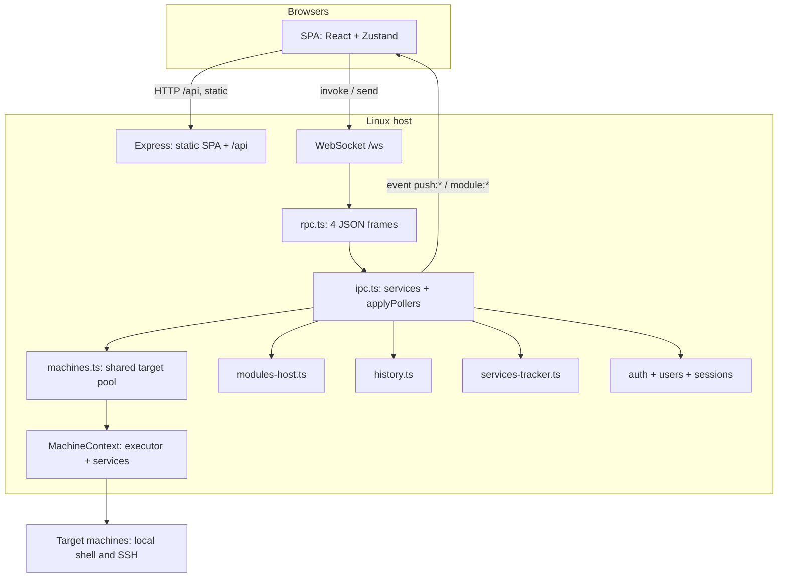

# Architecture

How Bored Manager is put together, and why. For the module system specifically, see [MODULES.md](MODULES.md). For writing a module, see [MODULE-RULESET.md](MODULE-RULESET.md).

## The idea

The app reimplements nothing. Everything it shows comes from tools that are already on the target machine (`/proc`, `ps`, `ss`, `ip`, `lsblk`, `df`, `dpkg`/`apt`, `nvidia-smi`, `docker`, `sensors`), read through a single executor that is either a local shell or an SSH session. The app's job is to batch those reads, diff the counters, and draw the result.

That is why "local machine" and "over SSH" are the same code path: one interface, two implementations.

The **server** runs on Linux. Every browser on the network talks to that one process and shares its pool of connected targets. Each target has an independent executor, collectors, module runtimes, history buffer, package service and terminal set. A browser chooses its own active machine, so clients can view different targets concurrently. Adding or disconnecting a target affects the shared pool; changing the active target does not affect another browser.

## Process layout



| File | Owns |
|---|---|
| `server/index.ts` | HTTP server, `/ws` upgrade, heartbeat ping/pong every 30s, `unlock` subcommand, SIGINT/SIGTERM → `cleanClose()` |
| `server/http.ts` | Express app: CSP, session cookie `bm.sid`, static `out/renderer/`, SPA fallback, `/api` router |
| `server/rpc.ts` | The four JSON frames, per-socket `activeTab` / `username` / `sessionId`, broadcast |
| `server/ipc.ts` | RPC wiring and `applyPollers()` — the single place that decides what runs for each target |
| `server/machines.ts` | The shared `MachinePool`; each `MachineContext` owns one manager, core collectors, package service and history buffer |
| `server/connection.ts` | One target's `ConnectionManager`: connect, disconnect, `exec` / `execSudo` / `stream` / `streamSudo` |
| `server/executors/local.ts`, `ssh.ts` | The two implementations. `ssh.ts` is imported lazily so a broken native binding can only affect a connect attempt, never startup |
| `server/session-registry.ts` | Process-wide safety net for resources that have to be released on close; per-machine teardown happens before pool removal |
| `server/services/*` | The app's own collectors and services (see below) |
| `server/auth.ts` | Login, logout, lockout, session gate on `/api` |
| `modules/<id>/main/` | A module's main half, compiled at runtime to `modules/<id>/.dist/main.mjs` |
| `modules/<id>/ui/` | A module's page and widget JSON specs |
| `src/` | The renderer: React, Tailwind, Radix, recharts, react-grid-layout, xterm.js |
| `src/modules/` | `BlockRenderer` + binding: every module page is built from specs, not from React the module shipped |
| `shared/` | Types and pure helpers used by the server **and** by modules |

## What the app itself collects

| Service | Reads | Emits |
|---|---|---|
| `services/metrics.ts` | `/proc/stat`, `/proc/meminfo`, `/proc/net/dev`, `/proc/diskstats`, `/proc/uptime`, `/proc/loadavg`, `hostname` | the `system` snapshot: CPU per core, memory, machine-wide network and disk rates, load, uptime |
| `services/top.ts` | `ps`, and optionally `/proc/PID/io` and `ss` | the busiest processes per resource, for the Overview cards |
| `services/services-tracker.ts` | Node's own CPU/RSS, `ps` for live children, poller tick timings | the `services` snapshot: what Bored Manager itself is running |
| `services/packages.ts` | `dpkg`/`apt`, `dnf`, `pacman` | installed and upgradable packages, and streamed action output |
| `services/terminals.ts` | a PTY on the target | the Terminals page — shared by every browser |
| `services/history.ts` | — | writes the metrics streams to `data/metrics/` |
| `services/updater.ts` | a GitHub zip / URL / uploaded file | the in-app app update |
| `services/modules-host.ts` | `modules/*` | discovery, integrity, compile, activation, `modules:specs` |
| `services/module-installer.ts` | a module zip | installing, updating, removing and reloading modules |
| `services/registry.ts` | `registry/modules.json` on the update repo | the community catalog (cached 24h in `data/registry-cache.json`) |
| `services/users.ts` | `data/users/users.json` | accounts (`bored-admin` is created on first boot) |

Everything else — the process table, network detail, disk detail, sensors, GPU, containers, the systemd fleet (`service-fleet`), BMC, OpenWRT — lives in a module.

## WebSocket RPC

Endpoint: `ws://<host>:<port>/ws`. Heartbeat ping/pong every **30s**. The browser reconnects with backoff 1→5s.

Four JSON frames:

| Direction | Shape |
|---|---|
| Client → server, needs a reply | `{ "kind": "invoke", "id": number, "channel": string, "args": unknown[] }` |
| Server → client, the reply | `{ "kind": "result", "id": number, "value": unknown }` or `{ "kind": "error", "id": number, "message": string }` |
| Client → server, fire and forget | `{ "kind": "send", "channel": string, "args": unknown[] }` — `ui:activeTab`, `term:write`, `term:resize` |
| Server → client, push | `{ "kind": "event", "channel": string, "payload": unknown }` |

Inbound frames are capped at 2 MiB (`RPC_LIMITS.maxPayload`) so a `file` form field can send a 1 MiB text list. Outbound results and the per-socket queue are capped at 8 MiB so a visibility-gated thousand-row table can return in one reply. Those limits live in `server/rpc.ts`.

When auth is on, an expired session closes the socket with code **4401**. HTTP 401 is the matching status on `/api/*`.

The surface is typed once in `src/lib/api.ts` and implemented by `src/lib/ws-api.ts`. Adding a module never means adding a channel by hand: `ctx.handle` registers under `module:<id>:invoke:<method>` and the host removes it again when the module is switched off.

### Channels

**Invoke** (request/response):

| Channel | Purpose |
|---|---|
| `conn:connect` / `conn:reconnect` | add a local/SSH target to the shared pool, or reconnect saved credentials server-side |
| `conn:disconnect(machineId)` / `conn:status` | remove one target / list every connected target |
| `conn:list` / `conn:credentials` / `conn:delete` | saved SSH hosts for **this** user |
| `metrics:history(machineId)` | latest `system` / `top` / `services` plus each module's snapshots for one target |
| `metrics:refreshSlow(machineId, target)` | take one slow reading now (`df`, `lsblk`, Docker df, …) |
| `history:query` / `history:stats` / `history:flush` / `history:purge` / `history:folder` | metrics on disk; `folder` returns the path string |
| `packages:overview` / `packages:search` / `packages:action` / `packages:cancel` / `packages:state` | the Packages page; `machineId` is the first argument |
| `term:create(machineId, …)` / `term:list` / `term:buffer` / `term:dispose` | terminals, tagged with their target |
| `settings:get` / `settings:set` | settings v4; changing `server.port` / `server.host` needs a restart |
| `auth:users` / `auth:createUser` / `auth:deleteUser` / `auth:setPassword` / `auth:setEnabled` | accounts; enabling auth requires `bored-admin` to already have a password |
| `modules:list` / `modules:enabledIds` / `modules:specs` | installed modules and their UI specs |
| `modules:setEnabled` / `modules:verify` / `modules:reload` | toggle, re-hash, recompile+reimport without restarting |
| `modules:installState` / `modules:checkUrl` / `modules:install` / `modules:uninstall` / `modules:cancel` | the install pipeline |
| `modules:catalog` / `modules:catalogRefresh` | community catalog (cache / force refetch) |
| `update:state` / `update:check` / `update:checkRepo` / `update:cancel` / `update:apply` / `update:consumeResult` | in-app app update |
| `app:info` / `app:restart` / `app:ping` | version + restart the server process |
| `module:<id>:invoke:<method>` | a module method registered with `ctx.handle` |

**Send** (no reply): `ui:activeMachine`, `ui:activeTab`, `term:write`, `term:resize`.

**Events** (server → every client, unless noted):

| Channel | Payload |
|---|---|
| `push:conn-status` | complete `MachineStatus[]` after a pool change, so coalescing cannot lose a transition |
| `push:conn-lost` | `{ machineId }` when one SSH session drops |
| `push:system` / `push:top` | `{ machineId, data }` from one target; each browser ignores machines it is not viewing |
| `push:services` | global cost of the Bored Manager process |
| `packages:log` / `packages:state` | live apt/dnf/pacman output |
| `term:data` / `term:exit` | terminal I/O, broadcast so every watcher sees the same PTY |
| `push:update` / `push:modules` / `push:modules-list` | updater / installer progress and the installed-module list |
| `module:<id>:event:<event>` | `{ machineId, data }` from one machine's module instance |

### HTTP (outside the socket)

Static files and the SPA are always served (the login form is part of the SPA). With auth on, every `/api/*` except `/api/auth/*` needs a valid session.

| Method | Path |
|---|---|
| POST | `/api/auth/login`, `/api/auth/logout` |
| GET | `/api/auth/status` |
| GET | `/api/settings/export` |
| POST | `/api/settings/import` |
| POST | `/api/modules/check-file` |
| POST | `/api/update/check-file` |

## Many clients, many connections

Each WebSocket has its own `activeMachine` and `activeTab`. `RpcRouter.activeTabsByMachine()` groups visible pages by target. A collector in `detailPolling` mode `tab` runs only while at least one client is viewing that tab **on that machine**; activity on another target cannot wake it. Every enabled module gets an isolated main instance and context per connected machine.

`push:conn-status` carries the complete shared pool after every add, reconnect, disconnect or loss. The renderer stores only its active selection and session reconnect list in `sessionStorage`; no credential is written there. Saved SSH credentials remain **per user** on the server (`data/users/<username>/connections.json`) and `conn:reconnect` consumes them without returning secrets to the browser. With auth off, everything belongs to `bored-admin`.

Terminals belong to a machine, not to a browser tab. `term:list` includes `machineId`; changing the active machine filters the visible terminal set while the other PTYs continue running. Disconnecting that machine disposes only its terminals.

## Users, session, lockout

- Auth is **off** by default. Every client then acts as `bored-admin`.
- Cookie `bm.sid`, HttpOnly, SameSite=Lax, secret from `data/secret.key`, store `data/sessions/`. Rolling idle: `auth.sessionIdle` default `{ value: 0, unit: "hour" }` means no expiry.
- Lockout is per username and per client address: `data/auth-lock.json`. After `auth.maxFailures` (default **5**) wrong passwords, that account or address returns HTTP 423 until `./bored-manager unlock` (or `node out/server/index.mjs unlock`) on the host. Unlock clears every counter.
- Passwords are scrypt hashes in `data/users/users.json` (`version: 1`). Deleting a user deletes `data/users/<username>/` as well. `bored-admin` cannot be deleted.

The app serves **plain HTTP**. Use it on a trusted LAN, or put TLS in front of it.

## Batching: one command per tick

Over SSH, a roundtrip costs far more than the command itself. So each collector builds **one** shell command per tick with `===NAME===` marker lines between the parts, and `splitSections()` (in `shared/shell.ts`) splits the output back into named sections:

```sh
echo '===STAT==='; cat /proc/stat; echo '===MEM==='; cat /proc/meminfo; ...
```

Two consequences worth knowing:

- Disabling a collector does not just hide a card, it **shortens the command**. Nothing is read that nobody looks at.
- A section can be conditional inside the same roundtrip. The Network module appends its inventory probes only when the cached copy has expired; the Sensors module runs its sysfs fallback only when `sensors` printed nothing.

## Two speeds per category

What changes every second and what changes every few minutes are collected on separate intervals:

| Fast (1–5s) | Slow (30s–30min, or manual) |
|---|---|
| CPU, memory, network and disk rates, sensors, GPU, containers, per-process counters, visible BMC tables, OpenWRT router status and WAN-binding reconciliation | mount usage and inodes (`df`), the block device list (`lsblk`), Docker disk usage (`docker system df`), interface addresses / MTU / link speed / gateway / DNS, BMC power sweep, service-fleet SSH sweep, OpenWRT PPPoE log scan and table-map self-heal |

Slow sections show how long ago they were read and carry a refresh button (`metrics:refreshSlow`). Starting a stopped poller or changing its interval ticks immediately; starting one again with the same interval is a no-op. Modules with slow pollers also remember their applied configuration so unrelated settings do not re-run `df`, `docker system df`, or a remote sweep.

## Rates come from counter diffs

Nothing on a Linux target reports a rate; everything reports a monotonic counter. Every rate in the app is `(now - before) / seconds`, which means:

- the first tick after connecting produces no rates (there is nothing to diff against);
- `reset()` on connect and disconnect is not optional — a counter from a different machine would produce a nonsense spike;
- a counter that wrapped or a device that disappeared is clamped at 0 rather than shown as negative.

## The polling decision

`applyPollers()` in `ipc.ts` is the only place that starts or stops the **core** collectors. It runs on pool changes, machine/tab selection, settings changes and socket close, and it is idempotent:

```
applyPollers()
├─ group active tabs by machine
├─ for each connected machine
│  ├─ configure its collectors from the shared settings
│  ├─ derive desired state; start/keep/stop system and top independently
│  └─ configure its fixed history buffer
├─ modulesHost.configure(settings, tabsByMachine) + apply()
│  └─ per enabled module × machine: activate/deactivate and applyPollers()
└─ start/keep the app-wide services poller only while the pool is non-empty
```

The `core:services` poller is **not** gated by a tab — it reports on the app's own upkeep whether or not anyone is looking at the Overview card. A module's `applyPollers()` is called with the same guarantees, which is why it has to re-derive its intervals from `ctx` rather than remember them.

For a module in `detailPolling: "tab"` mode, `ctx.tabActive` means either one of its pages is open or one of its enabled Overview widgets is visible on that machine. GPU, Sensors and Container default to `"always"` to preserve continuous history, but can opt into this mode in Settings; the GPU auto-cap watcher and all slow monitoring sweeps remain independent. A browser hidden for 30 seconds advertises no active tab until it becomes visible again.

GPU metrics are the one fast collector implemented as a long-running target stream: `nvidia-smi -lms` keeps NVML initialised while a bounded per-sample query updates compute processes. Stream startup/exit retries with backoff; three consecutive failures switch that connection to the older per-tick command path. The module kills the stream whenever its interval changes, its tab-gated surface disappears, the target disconnects, or the module is disabled.

## Modules at runtime

A module is a folder, not code compiled into the app's bundle.

1. `modules-host` reads every `modules/<id>/module.json` from disk.
2. The first time a module activates, esbuild bundles `entries.main` to `modules/<id>/.dist/main.mjs` (only `@shared/*` and the module's own files are allowed — see [MODULE-RULESET.md](MODULE-RULESET.md)).
3. The host `import()`s that file once per connected machine with `?v=…&m=<machineId>`. The machine parameter gives each target a separate ESM namespace (including module-level caches), while the version parameter makes **reload** pick up a new compile without restarting the server.
4. `modules:specs` sends each enabled module's `ui/pages/*.json` and `ui/widgets/*.json` to the renderer.

The renderer never executes module code. `src/modules/BlockRenderer.tsx` walks the spec; `src/modules/binding.ts` resolves each `DataSource`:

| `kind` | Reads |
|---|---|
| `stream` | the module bus (`ctx.emit` of a declared stream) |
| `invoke` | `module:<id>:invoke:<method>`, re-polled while the block is visible if `intervalKey` is set |
| `history` | downsampled points from `data/metrics/` (plus the live buffer for short ranges) |
| `core` | the app's own `system`, `top`, or `services` snapshot |

## Services tracker: measured vs estimated

`services-tracker.ts` answers "what is Bored Manager costing":

| Kind | CPU / RAM | What it is |
|---|---|---|
| `self` | **measured** — Node `process.cpuUsage()` delta and `rss` | the server process |
| `stream` / `shell` with a local `pid` | **measured** — one `ps -o pid=,pcpu=,rss=` for every live child | a `docker logs -f`, a PTY, … |
| `stream` / `shell` over SSH | no local pid, so no CPU/RAM | the command is on the other machine |
| `poller` | **not** a real CPU reading | the command lives a few milliseconds; `ps` cannot sample it |

For a poller the UI shows `estCostPct` = `lastTickMs / intervalMs * 100`, labelled as an **estimate**: how much of that poller's own budget the last tick used, not a share of the machine. A poller that goes quiet for more than two intervals ages out of the snapshot.

The reduced history stream is named `services`: `{ t, cpu, mem, count }`.

## State in the renderer

| Store | Holds |
|---|---|
| `src/state/store.ts` (Zustand) | Shared machine list, this tab's `activeMachineId`, settings, active page, installed modules, and the active machine's core rings/terminals/notices |
| `src/lib/module-bus.ts` (Zustand) | Every module's snapshots, keyed `<moduleId>:<event>` |

Keeping module data out of the app store is what makes a module removable: nothing in the core references `s.gpu` any more, and a module that is off simply stops being written to.

## Charts

`src/components/charts.tsx` has two components over recharts:

| | `Sparkline` | `DetailChart` |
|---|---|---|
| Used by | Overview cards (and compact widgets) | detail pages |
| Value ticks | 3 | 4 |
| Time ticks | 3 | 5 |

Both label the time axis (clock time, with seconds for ranges up to 10 minutes) and the value axis in the unit being measured, and both draw a reference grid in **both** directions.

Data comes from `useWindowedSeries` in `src/lib/history.ts`: ranges up to 10 minutes are served from the live buffer in the renderer; longer ones are read back from `data/metrics/`, already downsampled on the server, with the newest live samples appended so the chart still moves between refetches.

A widget spec that omits `window` inherits the Overview's history window. A page chart that omits `window` inherits the page's window picker.

## History on disk

```
data/metrics/<local | user@host>/<stream>-<YYYYMMDDHH>.jsonl
data/metrics/_app/services-<YYYYMMDDHH>.jsonl
```

NDJSON, one reduced sample per line, one file per stream per hour. Every machine context writes its own `system` and module streams. The app-wide `services` stream lives under `_app`, because it measures the one server process rather than a target.

- Samples are buffered in RAM and appended **once every five minutes** in a single append (plus on quit, on disconnect, and before clearing). A hard crash loses at most one batch.
- A 30-minute RAM ring answers short ranges without touching the disk.
- At every write, files older than the retention are deleted, and if the folder exceeds its cap the oldest hours go until it is under again.
- Old data is read line by line and averaged down to ~600 points before it reaches the renderer, so a 24-hour chart never loads a whole file.

## Clean close

Everything the app creates on a target is registered somewhere that gets disposed. Disconnecting one machine stops only its pollers, package action, module instances, history timer and terminals, then closes its executor. `cleanClose()` repeats that teardown for every pool entry, flushes `_app`, drains the process-wide registry with a 5-second budget and closes all remaining executors. Nothing is left running on any target.
