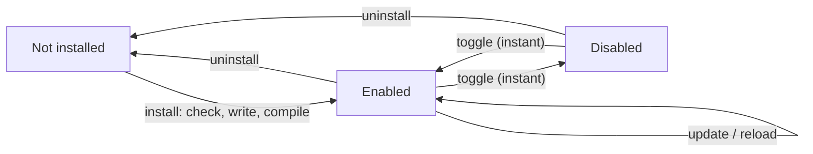

# Modules

How the app manages the modules it has. For writing one, see [MODULE-RULESET.md](MODULE-RULESET.md).

## What is a module and what is not

Everything except four pages is a module:

| Stays in the app | Is a module |
|---|---|
| Overview, Packages, Terminals, Settings | Processes, Network, Disk & storage, Sensors, GPU, Container, Services |
| The connection layer (local shell / SSH) | |
| The `system` metrics stream: CPU, memory, machine-wide network and disk rates, load, uptime | |
| The top-consumers collector that feeds the Overview cards | |
| The services tracker (what the app itself is running) | |
| The metrics history on disk, the app updater, the session registry | |

The seven modules the app ships with are **default modules**: recorded in `modules/modules.lock.json` when the release was built. They behave exactly like a module you install yourself, with one difference — if you uninstall one, the app cannot put it back on its own. Container and Services both ship **disabled** (`defaultEnabled: false`); enable them in Settings → Modules.

Two things stay in the app even though they look like they belong to a module, and both are deliberate:

- **The Network and Disk I/O cards on the Overview** are fed by the machine-wide rates in the `system` stream, not by those modules. They keep working when the modules are off, which is the point: a summary of the machine should not depend on which detail pages are installed.
- **The Top processes card** is fed by the app's own top-consumers collector, for the same reason. Its two extra sweeps still follow the modules that need them: `/proc/PID/io` only runs when the Disk module is enabled, and the `ss` dump only when the Network module is.

## The lifecycle

| Action | Rebuild the app? | Restart the server? | Why |
|---|---|---|---|
| Enable / disable | no | no | Only a flag in `data/user-settings/modules.json`. Pollers stop, the page and cards disappear, immediately. |
| Reload | no | no | Recompile `main/` → `.dist/main.mjs`, cache-bust `import()`, activate again. |
| Install / update / uninstall | no | no | The module is a folder. esbuild compiles its main half; the renderer already knows how to draw `ui/*.json`. |

Disabling is what you want for "stop collecting this". Uninstalling is for "remove the code". Reload is for "I edited the files on disk".

### What stopping a module actually does

Every one of those transitions goes through the same deactivation, in this order, so a module can never be half-running:

1. Its `dispose()` is called, with a working `ctx`, so it can shut things down politely.
2. Its `ctx` is revoked — every member throws from here on, whatever reference the module kept.
3. Its RPC channels are unregistered, so a browser that still has the page open gets an error rather than reaching code that is no longer supposed to run.
4. Every poller `ctx.createPoller` handed out is stopped and every command `ctx.stream` started is killed. Anything left at this point is a bug in the module and is logged as one.

Uninstalling does that **before** it deletes anything, and updating does it before the old folder is moved aside — otherwise a poll tick would land in the middle of the swap. The one thing that survives is a PTY opened from a `terminal` block: it belongs to the terminal pool, like a tab on the Terminals page, and closing it is the user's call.

## Three ways to install

Settings → **Modules** accepts the same three kinds of source as the app updater:

1. **`owner/repo` or a GitHub repo URL** — latest release zip, or the default-branch source zip if there is no release.
2. **A zip URL** (`https://…/*.zip`).
3. **A file** picked in the browser (`POST /api/modules/check-file`).

The catalog (below) is (1) with a reviewed hash. Pasting a URL or picking a file is the same pipeline afterwards: download to the OS temp folder, unpack, grade, then copy into `modules/<id>/` and compile. Nothing is written into the app folder before you have seen the checks.

Dev: drop the folder in `modules/` yourself and Reload. `npm run modules:pack -- <path>` builds a zip the installer will accept.

## Catalog and trust

`https://raw.githubusercontent.com/<settings.update.repo>/main/registry/modules.json` is the list of community modules a maintainer has reviewed. Cached in `data/registry-cache.json` for 24 hours; Settings → Modules → Catalog can force a refetch (`modules:catalogRefresh`).

Every archive the installer grades is hashed (SHA-256 of the **zip bytes**, before unpacking) and looked up by manifest `id`:

| Check id | Level | Meaning |
|---|---|---|
| `catalog-verified` | pass | That exact `id` + `sha256` is in the catalog |
| `unverified-source` | warning | Not listed, or the hash does not match — confirm before installing |
| `default` | warning | This would overwrite a module that **shipped with the app** (`source: "default"`) |

A GitHub host or a file you picked is `trusted` for the older "Source of the archive" warning; a zip from somewhere else is not. That is independent of the catalog: a github.com link is not automatically the reviewed version of that module, and a file on disk can still be a byte-for-byte copy of a reviewed release.

This is a trust signal, not a security boundary. A module still runs with the same access to the target machine as the app itself. sha256 only proves the bytes match what was reviewed.

See `registry/README.md` for the file schema and [MODULE-RULESET.md](MODULE-RULESET.md#getting-into-the-catalog) for how to propose an entry.

## Where the state lives

| Path | What |
|---|---|
| `modules/<id>/` | The module itself: manifest, `main/`, `ui/`, its README and CHANGELOG. `.dist/` is compiled at runtime and is not shipped. |
| `modules/modules.lock.json` | Version and hash of every module that shipped with the release (all seven, including the two that ship disabled). Generated by `npm run modules:lock`. |
| `data/user-settings/modules.json` | The app's record per module: enabled, installed version, hash, where it came from, when. |
| `data/user-settings/settings.json` | `overviewWidgets` keys like `gpu.summary`, and the `overviewLayout` positions of module cards. |
| `data/user-settings/module-config/<id>.json` | A module's **own** settings, through `ctx.configGet/configSet`. Shared by every target machine. |
| `data/module-data/<id>/<hostKey>.json` | What a module remembers about **one machine**, through `ctx.hostDataGet/hostDataSet`: tags it invented, job history, saved forms. `hostKey` is the same key the metrics history uses (`local`, or `user@host`). |
| `data/registry-cache.json` | Last fetched catalog. |

The registry lives next to the settings rather than inside the module folders, for two reasons: an app update carries `data/user-settings/` over, so a custom module stays enabled across updates; and the recorded hash has to live somewhere the module itself cannot rewrite. The same reasoning puts `module-config/` there: an override the user set survives reinstalling the module that reads it.

`module-data/` is under `data/` rather than `data/user-settings/` because it belongs to a machine, not to a preference — it is closer to the metrics history than to a setting, and like the history it is not worth carrying to a different install. Neither file may exceed 512 KB; a module that tries gets an exception rather than a full disk.

Every path above is keyed by the module id, and the id is the only thing a module can put in one: `ctx` binds `<id>` itself rather than taking it as an argument, and the two segments that do come from outside (the id, the host key) are refused unless they are a plain name, so a module cannot end up sharing a file with another one. A history stream name has the same rule from the other direction — a module may write `<id>` and `<id>-<name>` and nothing else.

### What uninstalling removes

| Path | Uninstall | Why |
|---|---|---|
| `modules/<id>/` | **removed** | The code, after the module has been stopped. |
| `data/user-settings/module-config/<id>.json` | **removed** | Only that module knew its shape; nothing else can ever read it again. |
| `data/module-data/<id>/` | **removed** | Same, for every machine at once. |
| `data/user-settings/modules.json` entry | **removed** | Nothing on disk backs it any more. |
| `settings.json` → `refresh.<key>`, `slowRefresh.<key>` | kept | A module-declared interval key is not filtered out of the settings file, so the speed the user chose is still there if the module comes back. |
| `settings.json` → `overviewWidgets`, `overviewLayout` | kept | Reinstalling puts the cards back where they were rather than at the end of the grid. Orphan keys are ignored by the Overview and hidden in Settings. |
| `data/metrics/<host>/<id>-*.jsonl` | kept | It belongs to the machine, not to the module, and it ages out on the normal retention. Settings → Data & storage → **Clear history** removes it early, along with everything else's. |

An **update** never comes through here — `install()` swaps the folder in place — so upgrading a module keeps its config, its per-host data and its history.

## Integrity

Every module folder is hashed with SHA-256: each file's relative path (NUL-terminated) and then its bytes, in sorted path order. **`.dist/` is skipped** — it is build output, rebuilt on demand, and is not in the lock file.

Sorting makes the digest independent of directory order, and hashing paths as well means renaming a file changes the hash even when no content did.

The hash is recorded at install time, from the lock file for the modules that shipped with the app. It is checked at every start and whenever you press **Verify**:

| Result | Meaning |
|---|---|
| `ok` | The files are exactly what was installed. |
| `modified` | Something on disk differs. Editing a module during development does this — it is a fact, not an accusation. The badge says "files modified"; the module still runs. |
| `unknown` | The folder could not be read. |

A module with no recorded hash (installed by an older build, or a release without a lock file) adopts what is on disk rather than reporting a false positive.

## The checks, then the install transaction

Each row in the result panel is `pass`, `info`, `warning` or `error`:

- an **error** blocks the install (wrong `apiVersion`, invalid id, missing `ui/` spec, esbuild/import failure, app too old, …);
- a **warning** needs confirming — reinstalling the same version, downgrading, overwriting a default module, an unverified catalog hash, a URL in compiled main, missing README/CHANGELOG, an untrusted download host;
- **info** explains what would happen: new module, or `1.0.0 -> 2.0.0`.

The version comparison against what is installed: newer is an `info`, same or older is a `warning` you have to confirm, and the confirmation dialog spells out which of the three it is. An `unverified-source` warning gets its own dialog ("Unverified module").

Then:

1. Stop the version that is running (if any), so nothing is polling out of a folder that is about to move.
2. Move `modules/<id>/` aside to `modules/<id>.backup-<timestamp>` (if it existed).
3. Copy the new folder into place.
4. Compile `main/` to `.dist/main.mjs` (the same compile the checker already ran in a temp dir).
5. **Succeeded**: record the version and the new hash, delete the backup, activate (or leave disabled). No restart.
6. **Failed**: delete the new folder, move the backup back and start it again. Nothing the user was looking at changed.

The full check table is in [MODULE-RULESET.md](MODULE-RULESET.md#the-checks-the-installer-runs).

## What an app update does to modules

`scripts/update.sh` replaces the whole app folder, which would take custom modules with it. So after restoring `data/`, the script:

1. copies back every module folder that is in the backup but **not** in the new version — a module that ships with both stays at the new version;
2. runs `install.sh --repair`;
3. if that build fails and modules were restored, moves them to `modules-disabled/` and builds once more — a module written for the previous version cannot block the update;
4. reports which modules were quarantined, in the log and in `data/update-result.json`.

To bring a quarantined module back: update its source for the new app version and install its zip from Settings → Modules.

| Data | After an app update |
|---|---|
| Default modules | replaced by the new version's |
| Custom modules | **kept**, or quarantined in `modules-disabled/` if they do not build |
| `data/user-settings/modules.json` | **kept** — enabled/disabled choices survive |
| `data/user-settings/settings.json` | kept and migrated |
| `data/users/` | **kept** (accounts and saved connections) |
| `data/secret.key` | **kept** (passwords and the session secret stay decryptable) |
| `data/metrics/` (chart history) | deleted |

## Settings a module reads

A module does not get its own settings section in the app's Settings. It reads the app's, through `ctx`:

| Setting | Read with |
|---|---|
| Update intervals → fast | `ctx.fastIntervalMs('gpu')` |
| Update intervals → slow | `ctx.slowIntervalSec('storage')` |
| Data collection → detail collectors | `ctx.detailMode('network')` |

The interval keys are open-ended, so a module can declare one of its own in `fastInterval` / `slowInterval` and read it the same way. Keys with no label in the UI still show their interval on the badge.

A module with settings of its **own** — limits, thresholds, anything the app has no opinion about — keeps them in `ctx.configGet/configSet` and gives itself a page for them, the way the Container module's *Module settings* page does. That keeps the app's Settings about the app.

## Migrating from before modules existed

A settings file with `settingsVersion` below 3 has a switch per feature and a fixed list of extended Overview cards. On the first start of a current build that file is rewritten through v3 (module enable flags, `overviewWidgets`) and then v4 (server/auth/update). The conversion only ever *disables*: a module you have since switched on is not turned off again by an old file.

The same conversion runs when you **import** a settings file exported by an older version.

## When a module is renamed

A module is keyed by its folder name, so renaming one would otherwise arrive as a brand new module at its own `defaultEnabled` — silently taking away a page somebody was using. `RENAMED_MODULES` in `server/services/modules-host.ts` maps the old id to the new one and moves the registry entry across at boot: the enabled flag and the install date follow, the version and hash are recomputed from the folder that is actually on disk, and the old entry is dropped. If an update unpacked over a previous install and left the old folder behind, it comes back as a new, switched-off module rather than running alongside its own successor — remove it in Settings → Modules.

Anything the settings file names has to move at the same time, which is a `SETTINGS_VERSION` bump: the interval keys under `refresh` / `slowRefresh`, and the `<id>.<widget>` keys in `overviewWidgets` and `overviewLayout`. v6 is the worked example (`docker` → `container`).
