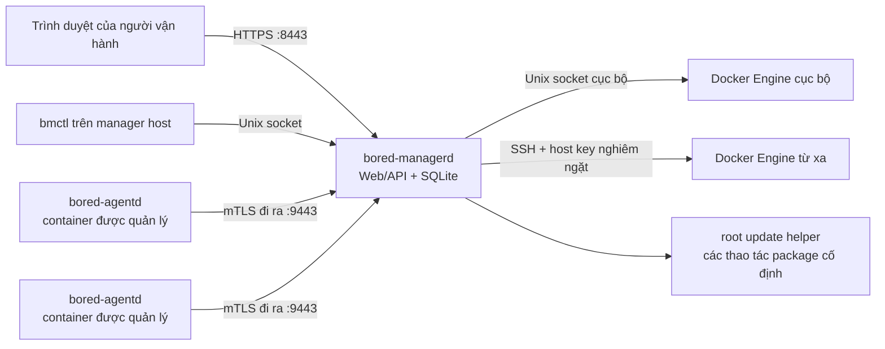

# Bored Manager

> **Trạng thái phát triển:** Bored Manager là một bản triển khai sớm, chưa phát hành. Hiện chưa có
> GitHub Release được hỗ trợ và trình cài đặt một dòng lệnh **chưa sẵn sàng để sử dụng trong môi
> trường production**. Trình cài đặt được lưu trong kho mã này được chủ đích thiết kế để dừng an
> toàn cho đến khi khóa công khai phát hành ngoại tuyến thật được quy trình phát hành nhúng vào.
> Nhánh `main` mô tả bản phát triển tiếp theo; mỗi thẻ phát hành sẽ cố định tài liệu tương ứng với
> bản phát hành đó.

Đây là bản hướng dẫn vận hành bằng tiếng Việt. Tài liệu tiếng Anh tại
[README.MD](../README.MD) là tài liệu chuẩn chính thức.

Bored Manager là một control plane nhỏ, tự lưu trữ để vận hành các container Ubuntu chạy theo mô
hình dịch vụ trên một hoặc nhiều Docker host. Dự án hợp nhất kiểm kê, tình trạng dịch vụ, thao tác
bền vững, truy cập terminal, cấp phát, mạng và cập nhật có kiểm soát trong một ứng dụng Web hướng
đến mạng LAN. Đối tượng sử dụng là những người vận hành cần quản lý nhiều dịch vụ systemd thông
thường mà không phải đưa vào Kubernetes, Docker Swarm, PostgreSQL, Redis hay một message broker
riêng.

Mục tiêu thiết kế là 1.000 agent kết nối đồng thời, mỗi agent có tối đa 20 dịch vụ được giám sát.
Mục tiêu này không phải là tuyên bố về khả năng của bản pre-release hiện tại. Bản ổn định `v1.0.0`
sẽ không được phát hành cho đến khi vượt qua các gate về quy mô, phục hồi, bảo mật, cập nhật và
purge trong [PLAN.md](../PLAN.md). Cả hai workflow phát hành đều cưỡng chế điều kiện này bằng một
bản ghi chứng nhận ràng buộc với tag/commit; hiện chưa có bản ghi như vậy nên việc phát hành stable
sẽ dừng an toàn.

## Tổng quan dự án

### Dự án dự kiến cung cấp những gì

- Một control plane trung tâm `bored-managerd`, cơ sở dữ liệu SQLite, Web UI, REST API, luồng sự
  kiện trực tiếp và endpoint dành cho agent.
- Một tiến trình `bored-agentd` chạy bằng root bên trong mỗi container Ubuntu được quản lý. Agent
  chủ động mở kết nối mTLS ra ngoài và không công khai cổng điều khiển.
- Truy cập Docker Engine cục bộ qua `/var/run/docker.sock`, chỉ sau khi người vận hành xác nhận rõ
  cảnh báo rằng quyền này tương đương quyền root.
- Truy cập Docker Engine từ xa qua SSH với kiểm tra host key nghiêm ngặt và tunnel SSH đến Unix
  socket ở máy từ xa. Không bao giờ dùng Docker TCP không xác thực.
- Định nghĩa dịch vụ có phiên bản, health check, thao tác dịch vụ có kiểu, cảnh báo, batch job bền
  vững, terminal tương tác, image template, cấp phát và phân bổ mạng được quản lý.
- Cập nhật package có chữ ký, sao lưu SQLite trực tuyến, rollback, gỡ package không phá hủy dữ liệu
  và workflow purge có kiểm tra quyền sở hữu.

Các tính năng trong danh sách này là mục tiêu của v1. Hãy xem release notes để biết chính xác tập
tính năng của từng bản pre-release.

### Kiến trúc



Manager là tiến trình ghi duy nhất cho trạng thái có thẩm quyền. Giao thức v1 dành riêng các dịch
vụ control, shell và artifact để một phiên truyền terminal lớn không làm nghẽn heartbeat. Runtime
pre-alpha hiện tại mới triển khai phần enrollment/heartbeat và endpoint HTTPS bootstrap artifact
được manager ký và lưu cache trên listener TLS riêng cho agent; các luồng gRPC shell và artifact
riêng biệt mới chỉ có contract và chưa thể bật. REST snapshot bao gồm event cursor; client bỏ lỡ
một dải sự kiện sẽ được yêu cầu đồng bộ lại thay vì âm thầm hiển thị dữ liệu cũ.

### Nền tảng được hỗ trợ và không được hỗ trợ

Mục tiêu chứng nhận v1 được chủ đích giới hạn:

- Manager: Ubuntu Desktop 24.04 LTS, amd64, systemd.
- Container được quản lý và Docker host: Ubuntu 24.04 LTS, amd64, cgroup v2.
- Docker Engine: Engine rootful 28.5.1 trở lên; phiên bản chứng nhận tham chiếu là 29.6.2.
- Trình duyệt: bản Firefox, Chromium, Chrome hoặc Edge hiện hành, có bật JavaScript.

Các nền tảng sau không được hỗ trợ trong v1: ARM, bản phân phối không phải Ubuntu, rootless Docker,
Docker Desktop làm production host, Kubernetes, Docker Swarm, LXD, manager high-availability,
Docker-in-Docker theo mặc định, tự động cài Docker và phơi dịch vụ ra Internet công cộng khi không
có reverse proxy cùng chứng chỉ do người vận hành quản lý. Bored Manager không cung cấp DHCP
plugin; một plugin bên ngoài phải vượt qua compatibility gate trước khi bật chế độ DHCP.

## Yêu cầu

### Manager host

Cấu hình tối thiểu cho môi trường phát triển/lab là 2 CPU core, RAM 4 GiB và 20 GiB dung lượng SSD
trống. Điểm khởi đầu phù hợp cho hàng trăm agent là 4 CPU core, RAM 8 GiB và 50 GiB SSD trống. Cần
tính dung lượng cho output lệnh được lưu, artifact, image và backup. Chính sách SQLite v1 đặt quota
mặc định 10 GiB, tăng tốc dọn dữ liệu ở mức 80% và từ chối output không thiết yếu mới ở mức 90%.
Bản pre-alpha hiện tại hiển thị giới hạn này trong cấu hình và chẩn đoán nhưng chưa chạy retention
worker hay từ chối thao tác ghi; người vận hành phải theo dõi kích thước database và WAL cho đến khi
lifecycle gate công bố quota enforcement đã sẵn sàng.

Host phải có:

- Ubuntu Desktop 24.04 LTS amd64, systemd, `sudo`, `curl`, OpenSSL, Python 3 và các công cụ dpkg.
- Định tuyến LAN hoặc VPN ổn định đến container được quản lý và Docker host từ xa.
- DNS hoạt động hoặc địa chỉ ổn định, cùng thời gian hệ thống được đồng bộ.
- HTTPS đi ra đến GitHub Releases để cập nhật manager, trừ khi release được mirror.
- Truy cập SSH từ manager đến mọi Docker host từ xa.

Các listener mặc định:

| Cổng/đường dẫn | Hướng | Mục đích |
| --- | --- | --- |
| TCP 8443 | Trình duyệt đến manager | HTTPS Web UI và REST/WebSocket API |
| TCP 9443 | Agent đến manager | Endpoint mTLS dành cho agent |
| TCP 22 | Manager đến remote host | Tunnel SSH đến Docker Unix socket từ xa |
| `/run/bored-manager/manager.sock` | Chỉ cục bộ | Các thao tác CLI/health đặc quyền cục bộ |
| `/var/run/docker.sock` | Manager đến Engine cục bộ | Docker connector cục bộ tùy chọn |

Có thể cấu hình lại cổng sau quá trình setup. Không mở 8443 hoặc 9443 ra Internet công cộng theo
mặc định. Listener setup ban đầu chỉ bind vào `127.0.0.1`.

### Cảnh báo quyền Docker

Thành viên của group sở hữu Docker socket trên thực tế có quyền root: một tiến trình có thể mount
filesystem của host hoặc khởi chạy container đặc quyền qua Docker API. Trình cài đặt không bao giờ
đổi socket sang mode `0666`, không bao giờ bật `tcp://2375`, không bao giờ cài Docker và không chỉnh
firewall. Nếu chấp nhận Docker cục bộ, một systemd drop-in chỉ cấp group của socket cho service
manager. Hãy từ chối đăng ký cục bộ nếu không chấp nhận ranh giới tin cậy đó.

### Hoạt động của TLS

Web UI ban đầu dùng chứng chỉ được tạo cục bộ. Cảnh báo của trình duyệt là bình thường cho đến khi
cấu hình chứng chỉ được người vận hành tin cậy hoặc reverse proxy. So sánh fingerprint do trình
cài đặt in ra với `sudo bmctl diagnostics` trước khi chấp nhận chứng chỉ. Transport của agent dùng
một CA riêng và mTLS; việc chấp nhận chứng chỉ Web UI không đồng nghĩa với enrollment agent.

## Cài đặt nhanh

### Kiểm tra tính sẵn sàng của release

Hiện chưa có release được hỗ trợ. Hãy xác nhận trang
[Releases](https://github.com/FireStarsSoft/Bored-Manager/releases) của repository có một release
đã phát hành, không phải draft, và đọc release notes trước khi dùng một trong hai quy trình dưới
đây. Không chạy lệnh với `main`, artifact của pull request hoặc asset chưa được ký.

### Cài manager bằng một dòng lệnh

Sau khi release có chữ ký đầu tiên được phát hành, lệnh chính thức sẽ là:

```bash
tmp="$(mktemp)" && { curl --proto '=https' --proto-redir '=https' --tlsv1.2 -fL --retry 3 -o "$tmp" https://github.com/FireStarsSoft/Bored-Manager/releases/latest/download/install-manager.sh && bash "$tmp"; rc=$?; rm -f "$tmp"; (exit "$rc"); }
```

Bootstrap chạy dưới user hiện tại. Nó tải manifest có chữ ký, kiểm tra fingerprint của release key
được nhúng, xác minh manifest và checksum, kiểm tra cả hai Debian package rồi mới yêu cầu `sudo`.
Nó cài package manager và cache trình cài đặt agent cùng package khớp phiên bản đã xác minh. Nó
không thực thi response mạng chưa được xác minh.

Output thành công dự kiến bao gồm phiên bản release đã xác minh, hash package, health systemd, URL
Web UI, fingerprint HTTPS và trạng thái Docker host cục bộ có được đăng ký hay không. Nếu Docker
không tồn tại, đã dừng, là rootless hoặc không truy cập được, quá trình cài manager vẫn hoàn tất và
không tạo host record bị hỏng.

Các tùy chọn hữu ích của trình cài đặt:

```text
--dry-run                     inspect and verify without changing the host
--version X.Y.Z               install an exact release
--no-start                    install but do not start services
--skip-local-docker           never offer local Docker registration
--accept-local-docker-risk    non-interactive acknowledgement of root-equivalent access
--allow-downgrade             acknowledge downgrade intent; transition still requires updater
```

### Bootstrap cố định phiên bản và checksum

Với môi trường được kiểm soát, trước hết hãy lấy fingerprint của release public key qua một kênh
tin cậy độc lập, xác minh chữ ký Ed25519 của manifest đã tải, rồi mới sao chép SHA-256 của trình cài
đặt từ manifest đó. Thay tag release và digest thật vào bên dưới. Giữ nguyên dấu nháy.

```bash
release_tag="vX.Y.Z"
installer_sha256="REPLACE_WITH_64_HEX_CHARACTERS_FROM_SIGNED_MANIFEST"
installer="$(mktemp)"
curl --proto '=https' --proto-redir '=https' --tlsv1.2 -fL --retry 3 \
  -o "$installer" \
  "https://github.com/FireStarsSoft/Bored-Manager/releases/download/${release_tag}/install-manager.sh"
printf '%s  %s\n' "$installer_sha256" "$installer" | sha256sum --check --strict
bash "$installer" --version "${release_tag#v}"
rc=$?
rm -f "$installer"
exit "$rc"
```

Checksum bên ngoài này bảo vệ khỏi việc vô tình dùng nhầm trình cài đặt. Trust root Ed25519 được
nhúng trong trình cài đặt vẫn xác thực manifest release và tập package.

## Thiết lập lần đầu

Workflow này sẽ khả dụng trong bản alpha đầu tiên có trình cài đặt. Trước thời điểm đó, chỉ sử dụng
workflow phát triển ở phần sau của tài liệu này.

1. Mở URL setup loopback do trình cài đặt in ra, thông thường là
   `https://127.0.0.1:8443/setup`.
2. So sánh fingerprint chứng chỉ đang hiển thị với output của trình cài đặt. Không tiếp tục nếu hai
   giá trị khác nhau.
3. Tạo administrator đầu tiên với mật khẩu duy nhất được lưu trong password manager. Setup chỉ
   được dùng một lần; các lần thử tiếp theo phải trả về lỗi authorization.
4. Chọn địa chỉ bind LAN/VPN và xác nhận cổng 8443 cùng 9443 không xung đột. Giữ chế độ chỉ
   loopback nếu trình duyệt từ xa và agent chưa sẵn sàng. Packaged service không đặc quyền chỉ chấp
   nhận các cổng từ 1024 đến 65535.
5. Xem lại kết quả phát hiện Docker cục bộ. UI chỉ có thể đăng ký socket khi `bored-managerd` đã
   truy cập được socket; quyền group ở cấp hệ điều hành trước hết phải do trình cài đặt đã xác minh
   hoặc workflow host đã review cấp. Nếu chưa có quyền, hãy bỏ qua và thêm host sau.
6. Lưu cấu hình. Nếu listener thay đổi, trang setup sẽ hiển thị lệnh restart thủ công vì manager
   không đặc quyền không thể restart systemd unit của chính nó. Chạy các lệnh restart và health
   hiển thị trên màn hình, kết nối lại qua địa chỉ LAN/VPN thật, so sánh lại fingerprint chứng chỉ
   rồi đăng nhập. Session cookie loopback không được tái sử dụng trên origin mới.
7. Xác minh health cục bộ và khả năng tự khởi động sau reboot:

```bash
bmctl version
sudo bmctl health
bmctl open-ui
systemctl is-enabled bored-managerd.service
systemctl is-active bored-managerd.service
sudo systemctl restart bored-managerd.service
sudo bmctl health
```

Nếu đã chấp nhận quyền Docker cục bộ nhưng cần tạo lại host record, trước tiên hãy xác minh systemd
Docker-group drop-in rồi dùng local control socket:

```bash
sudo bmctl docker-host add-local --name local --socket /var/run/docker.sock \
  --confirmation "I UNDERSTAND DOCKER ACCESS IS ROOT-EQUIVALENT"
```

Không công khai endpoint health TCP tạm thời không xác thực và không thay đổi mode của Docker
socket.

## Cài đặt và enrollment agent

Enrollment agent đang được phát triển và chưa phải là một đường cài đặt được hỗ trợ. Luồng hoàn
chỉnh sẽ không đặt bearer enrollment token trong command line, biến môi trường hoặc shell history.

1. Trong Web UI, mở **Agents → Add agent**, chọn đúng phiên bản tương thích với manager và nhập URL
   manager.
2. So sánh CA/SPKI pin trong UI với giá trị hiển thị trên console của máy đích.
3. Chạy lệnh đúng phiên bản do UI tạo. Lệnh tải `install-agent.sh` bằng TLS SPKI pin chính xác, sau
   đó xác minh manifest có chữ ký ngoại tuyến và package `bored-manager-agent`. Trên endpoint
   bootstrap tự ký, việc xác minh chuỗi public CA được chủ đích thay bằng pin đã được đối chiếu độc
   lập; trình cài đặt không bao giờ chấp nhận kết nối TLS không pin.
4. Agent tạo private key và CSR tại chỗ. Private key không bao giờ được gửi đến manager.
5. Mở **Agents → Pending approval**. So sánh CSR SHA-256 fingerprint và mã xác minh ngắn hiển thị ở
   cả hai nơi. Xác thực lại rồi approve hoặc reject.
6. Yêu cầu approval hết hạn sau 10 phút. Nếu hết hạn, chạy lại enrollment để tạo yêu cầu mới;
   không bao giờ gia hạn hoặc tái sử dụng challenge đã hết hạn.

Khi đã có release, có thể kiểm tra package mà không thay đổi máy đích:

```bash
bash install-agent.sh --manager-url "https://manager.example.invalid:9443" \
  --manager-spki-pin "sha256//BASE64_SPKI_PIN_FROM_MANAGER" \
  --version "X.Y.Z" --dry-run
```

Để từ chối một yêu cầu, dùng màn hình pending approval. Để thay thế identity bị hỏng hoặc bị sao
chép, chỉ xóa `/var/lib/bored-manager-agent` thông qua workflow phục hồi
`bmctl agent reset-identity` trong tương lai; xóa file trực tiếp có thể tạo audit record mồ côi.
Một lần reset sẽ tạo agent UUID và key mới, đồng thời liên kết với enrollment đã bị thay thế.

API revoke của pre-alpha hiện tại yêu cầu administrator xác thực lại gần đây, lý do được ghi lại,
xác nhận chính xác `REVOKE <agent UUID>`, kiểm tra CSRF và idempotency key. Chứng chỉ đã revoke bị từ
chối ở heartbeat HTTPS kế tiếp. Việc đóng ngay control stream đang mở vẫn là gate v1 vì transport
pre-alpha chưa duy trì luồng gRPC đó.

Provisioning do manager khởi tạo không nhúng credential vào image. Nó dùng challenge một lần, đã
được phê duyệt trước, ràng buộc với provision job, logical instance và image digest chính xác.
Challenge được truyền qua tmpfs/stdin và mất hiệu lực sau lần sử dụng đầu tiên hoặc khi hết hạn.

## Vận hành hằng ngày

Trong giai đoạn phát triển sớm, chỉ bề mặt binary/version/health cơ bản được kỳ vọng hoạt động. Các
lệnh dưới đây được đánh dấu **dự kiến** không được tự động hóa cho đến khi release notes công bố
chúng đã sẵn sàng.

### Service và chẩn đoán cục bộ

```bash
sudo systemctl status bored-managerd.service --no-pager
sudo systemctl restart bored-managerd.service
sudo journalctl -u bored-managerd.service --since "30 minutes ago" --no-pager
bmctl version
sudo bmctl health
sudo bmctl diagnostics
```

Trên một agent container:

```bash
sudo systemctl status bored-agentd.service --no-pager
sudo systemctl restart bored-agentd.service
sudo journalctl -u bored-agentd.service --since "30 minutes ago" --no-pager
```

Dùng Web UI cho kiểm kê service và desired state. Mỗi service có các trường presence,
availability, runtime và health riêng; `absent`, `stopped` và `unhealthy` không tương đương. Các
thao tác install/start/stop/restart/update có kiểu sẽ tạo job bền vững và có thể retry an toàn bằng
idempotency key. Không bỏ qua job bị kẹt bằng cách chỉnh SQLite.

### Thêm Docker host từ xa (dự kiến)

1. Ghi lại SSH fingerprint của host qua một kênh ngoài hệ thống đáng tin cậy.
2. Nạp private key dưới dạng encrypted systemd credential do root sở hữu và được đặt tên theo
   host đó. Web API chỉ nhận credential reference; không bao giờ nhận byte của private key.
3. Trong **Docker Hosts → Add**, nhập tên, địa chỉ, SSH port/user, credential reference, dòng
   `known_hosts` chính xác, fingerprint đã xác minh độc lập và đường dẫn socket (thông thường là
   `/var/run/docker.sock`).
4. Chạy preflight. Host key thay đổi sẽ chặn kết nối; không có tùy chọn tự động chấp nhận.
5. Xử lý các phát hiện về engine/API, cgroup v2, storage, DNS, route, address pool và xung đột cổng.
6. Chỉ bật host sau khi preflight vượt qua.

Trên manager host, nạp trước một key đã review mà không đặt nội dung key trong argument, biến môi
trường hoặc database. Chỉ thay hai giá trị đường dẫn/tên:

```bash
credential_name='ssh-dockyard-03.key'
private_key_path='/root/offline-input/dockyard-03_ed25519'
[[ "$credential_name" =~ ^[A-Za-z0-9][A-Za-z0-9_.-]{0,127}$ ]] || exit 1
[[ "$private_key_path" == /* && -f "$private_key_path" && ! -L "$private_key_path" ]] || exit 1
sudo install -d -o root -g root -m 0700 /etc/credstore.encrypted
sudo systemd-creds encrypt --name="$credential_name" \
  "$private_key_path" "/etc/credstore.encrypted/${credential_name}"
drop_in="$(mktemp)"
printf '[Service]\nLoadCredentialEncrypted=%s\n' "$credential_name" >"$drop_in"
sudo install -d -o root -g root -m 0755 \
  /etc/systemd/system/bored-managerd.service.d
sudo install -o root -g root -m 0600 "$drop_in" \
  "/etc/systemd/system/bored-managerd.service.d/50-${credential_name}.conf"
rm -f "$drop_in"
sudo systemctl daemon-reload
sudo systemctl restart bored-managerd.service
sudo bmctl health
```

Xóa hoặc trả plaintext source key về kho lưu trữ được bảo vệ sau khi đã xác minh encrypted
credential và bản recovery. Việc xóa profile Docker host không xóa credential; chỉ xóa drop-in và
file mã hóa sau khi xác nhận không host nào khác còn tham chiếu tên đó.

### Dashboard, terminal, batch và provisioning (dự kiến)

- Lọc theo alias, UUID, host, tag, service, presence, runtime hoặc health. `resync_required` yêu cầu
  làm mới snapshot và không phải lỗi có thể bỏ qua.
- Phiên terminal mặc định dùng tài khoản `bored-shell` bị giới hạn. Root yêu cầu xác thực lại rõ
  ràng, lý do và audit event. Đóng terminal phải kết thúc PTY và mọi tiến trình con.
- Batch command dùng barrier prepare/ready/commit và hiển thị output theo từng target. Hủy bỏ là
  thao tác bền vững; target bỏ lỡ lease không được khởi chạy muộn.
- Provisioning dùng template revision bất biến và image digest. Xem lại preflight, reservation,
  service đã chọn và kế hoạch ownership trước khi commit.
- Chế độ bridge, static pool, macvlan và ipvlan cần management bridge riêng để agent egress ổn
  định. DHCP vẫn bị tắt cho đến khi một plugin/version/digest bên ngoài được chứng nhận.

## Cập nhật và rollback

Cập nhật được thực hiện thủ công và dựa trên package. v1 không có cập nhật stable channel không
giám sát.

1. Đọc release notes và dải tương thích. Manager phiên bản N hỗ trợ agent N và N-1.
2. Tạo và xác minh online backup trước khi stage bất kỳ package nào.
3. Cho manager tải release có chữ ký một lần và cache đúng artifact. Agent không tải release trực
   tiếp từ Internet.
4. Cập nhật một nhóm canary nhỏ rồi tiếp tục theo từng wave. Rollout dừng nếu tỷ lệ lỗi vượt 2%,
   agent không kết nối lại trong vòng 45 giây hoặc lỗi crash/check tăng bất thường.
5. Chỉ cập nhật manager sau khi artifact, metadata backup, dung lượng đĩa và schema migration đã
   được xác minh.

Nền tảng update helper hiện tại chỉ chấp nhận các thao tác package cục bộ cố định qua Unix socket
do root sở hữu, kiểm tra peer credential và xác minh lại staged package. Nó không thể nhận URL tùy
ý hay shell command. Health orchestration, migration marker, tự động cài lại N-1 và phục hồi backup
tương ứng vẫn bị chặn bởi lifecycle acceptance test; không bản pre-alpha nào được quảng bá rollback
tự động. Sau khi gate đó đạt, `bmctl version` và `dpkg-query` phải trùng khớp:

```bash
bmctl version
dpkg-query -W -f='${Version}\n' bored-manager
sudo journalctl -u bored-managerd.service -u bored-update-helper.service \
  --since "30 minutes ago" --no-pager
```

Cho đến khi update CLI được phát hành, không cài thủ công binary mới có quyền ghi database chồng
lên state directory hiện có. Xem [runbook phát hành](runbooks/release.md).

## Sao lưu và khôi phục sau thảm họa

Mặc định dự kiến là một online backup mỗi ngày và giữ lại bảy bản. Một backup set hợp lệ chứa image
tạo bởi SQLite online-backup, cấu hình, metadata schema/version, metadata release và CA export được
mã hóa. File database được sao chép trong khi service đang ghi không phải backup được hỗ trợ.

Quy trình cho người vận hành:

1. Ghi lại `bmctl version`, dung lượng đĩa trống và health hiện tại từ `sudo bmctl health`.
2. Dùng lệnh backup do release đã cài cung cấp; lưu archive bên ngoài
   `/var/lib/bored-manager` và kiểm tra tính toàn vẹn.
3. Export CA material bằng passphrase mới có entropy cao sang kho ngoại tuyến. Không bao giờ đặt
   passphrase trong shell history hoặc process argument.
4. Chỉ restore vào phiên bản manager bằng hoặc được tuyên bố tương thích rõ ràng.
5. Dừng manager, bảo toàn state directory bị hỏng, restore qua `bmctl`, khởi động và xác minh tính
   toàn vẹn database, schema version, certificate chain, agent, job và audit history.

Nếu database hỏng nhưng trạng thái CA còn nguyên, restore backup đã xác minh mới nhất và cho agent
kết nối lại. Nếu mất CA private key, không thể âm thầm cấp lại agent: hãy phục hồi bản CA mã hóa
hoặc thực hiện CA reset có kiểm soát rồi enrollment lại mọi agent. Không bao giờ tạo CA mới dưới
tên cũ và coi nó tương đương.

Các lệnh pre-release chính xác và điểm rollback được duy trì trong
[runbook backup/restore](runbooks/backup-restore.md).

## Gỡ cài đặt và purge

`apt remove bored-manager` dừng/vô hiệu hóa package unit và xóa chương trình do dpkg sở hữu. Nó giữ
lại cấu hình, state, backup, artifact đã cache, user và mọi Docker resource. Gỡ agent không bao giờ
xóa các service được giám sát.

Purge là một workflow ownership riêng, phải xác nhận rõ. Wizard `bmctl purge` trong tương lai sẽ
export inventory trước rồi hỏi riêng có xóa từng nhóm sau hay không:

- database/configuration/CA và backup của manager;
- release artifact đã cache và derived image thuộc sở hữu Bored Manager;
- state và identity của agent;
- container được quản lý;
- network được quản lý cùng IP/MAC reservation;
- volume được quản lý;
- DHCP plugin đã chứng nhận.

Mỗi lựa chọn phá hủy đều yêu cầu gõ nội dung xác nhận. Docker object chỉ đủ điều kiện khi label
`io.firestarssoft.bored-manager.*` và ownership record trong database khớp nhau. Chỉ label, tiền tố
tên hoặc database row mồ côi đều không đủ. Gỡ package thông thường và `apt purge` không được suy
diễn thành quyền xóa Docker resource của người dùng.

Sau purge, xác minh không còn unit, process, listener, socket, lock, staging file hoặc Docker object
đã chọn thuộc ownership. Giữ ownership manifest đã export cùng audit record. Làm theo
[runbook remove/purge](runbooks/remove-purge.md); không thay thế bằng một lệnh `rm -rf` gần đúng.

## Tham chiếu cấu hình

Schema cấu hình cuối cùng được kiểm soát bằng contract và có thể thay đổi trước bản alpha đầu tiên.
Package dành riêng các vị trí ổn định sau:

| Mục | Mặc định |
| --- | --- |
| Cấu hình JSON tùy chọn của manager | `/etc/bored-manager/manager.json` |
| Cấu hình JSON tùy chọn của agent | `/etc/bored-manager/agent.json` |
| State/SQLite của manager | `/var/lib/bored-manager` |
| Identity/state của agent | `/var/lib/bored-manager-agent` |
| Cache release/artifact | `/var/cache/bored-manager` |
| Runtime socket | `/run/bored-manager` |
| Tài khoản service manager | `bored-manager` |
| Tài khoản terminal mặc định của agent | `bored-shell` |
| Listener Web/API | `127.0.0.1:8443` trong setup; địa chỉ đã cấu hình sau đó |
| Listener agent | Địa chỉ được cấu hình trên TCP 9443 |
| Chu kỳ kiểm tra service | Mặc định 30 giây; trạng thái hiển thị trong vòng 60 giây |
| Raw metric sample | 15 giây trong bộ nhớ |
| Persistent metric aggregate | 1 phút và 15 phút |
| Quota SQLite | Chính sách v1: 10 GiB, áp lực retention ở 80%/90%; pre-alpha chưa thực thi |
| Backup | Mặc định hằng ngày, bảy bản |
| Kênh cập nhật | Chọn stable/pre-release thủ công |

Packaged unit đọc các file biến môi trường tùy chọn do root sở hữu tại
`/etc/default/bored-manager`, `/etc/default/bored-manager-agent` và
`/etc/bored-manager/agent.env`. JSON chỉ được dùng khi `BORED_MANAGER_CONFIG` hoặc
`BORED_AGENT_CONFIG` trỏ đến file đã review. Giá trị biến môi trường ưu tiên hơn JSON.

| Biến manager | Ý nghĩa/mặc định |
| --- | --- |
| `BORED_MANAGER_CONFIG` | Đường dẫn cấu hình JSON tùy chọn; mặc định không đặt |
| `BORED_MANAGER_BIND` | Địa chỉ listener; `127.0.0.1` trước authenticated setup |
| `BORED_MANAGER_WEB_PORT` / `BORED_MANAGER_AGENT_PORT` | HTTPS 8443 / agent 9443; hai cổng không đặc quyền khác nhau trong khoảng 1024–65535 |
| `BORED_MANAGER_STATE_DIR` / `BORED_MANAGER_CACHE_DIR` | Root của state và verified artifact như trên |
| `BORED_MANAGER_RUNTIME_DIR` | Thư mục runtime/socket, `/run/bored-manager` |
| `BORED_MANAGER_WEB_DIR` | SPA đã build, `/usr/share/bored-manager/web` |
| `BORED_MANAGER_DATABASE` | Đường dẫn SQLite, `/var/lib/bored-manager/manager.db` |
| `BORED_MANAGER_WEB_CERT` / `BORED_MANAGER_WEB_KEY` | Đường dẫn Web certificate/private key bên dưới manager state |
| `BORED_MANAGER_AGENT_CA` / `BORED_MANAGER_AGENT_CA_KEY` | Certificate/key của agent CA; packaged operation yêu cầu private key qua encrypted systemd credential `agent-ca.key` |
| `CREDENTIALS_DIRECTORY` | Đường dẫn chỉ đọc do systemd đặt cho CA/SSH credential đã giải mã; người vận hành không được tự đặt hoặc ghi đè |
| `BORED_MANAGER_SESSION_IDLE` / `BORED_MANAGER_SESSION_LIFETIME` | Chuỗi Go duration; mặc định 30 phút / 12 giờ |
| `BORED_MANAGER_DATABASE_LIMIT` | Giới hạn database theo byte; mặc định 10 GiB; chỉ chẩn đoán trong pre-alpha hiện tại |
| `BORED_MANAGER_EVENT_BUFFER` | Live-event buffer có giới hạn; 16–4.095 entry, mặc định 1.024 |
| `BORED_MANAGER_DEV_HTTP` | Chế độ plaintext chỉ dành cho phát triển; phải là false trong packaged operation |

| Biến agent | Ý nghĩa/mặc định |
| --- | --- |
| `BORED_AGENT_CONFIG` | Đường dẫn cấu hình JSON tùy chọn do root sở hữu |
| `BORED_AGENT_MANAGER_URL` | URL HTTPS của manager, bắt buộc |
| `BORED_AGENT_MANAGER_SPKI_PIN` | Public-key pin `sha256//...`, bắt buộc |
| `BORED_AGENT_NAME` | Tên nguồn hiển thị; mặc định là hostname của container |
| `BORED_AGENT_STATE_DIR` | Root của identity/state, `/var/lib/bored-manager-agent` |
| `BORED_AGENT_CERT` / `BORED_AGENT_KEY` / `BORED_AGENT_CA` | Đường dẫn identity và trust cục bộ bên dưới agent state |
| `BORED_AGENT_HEARTBEAT` | Go duration từ 5 giây đến 5 phút; mặc định 15 giây |

Trong khi chờ approval, agent chỉ lưu metadata resumable request tại
`/var/lib/bored-manager-agent/pending-enrollment.json`; không bao giờ lưu enrollment bearer token.
File được xóa sau approval, rejection, expiry hoặc identity reset.

`bmctl` cục bộ chấp nhận `BORED_MANAGER_SOCKET`, `BORED_MANAGER_URL` và
`BORED_MANAGER_SPKI_PIN`. Không dùng biến môi trường cho private key hoặc passphrase.

Các chế độ Docker network được hỗ trợ trong v1 là user-defined bridge với dynamic IPAM, bridge với
static pool do manager sở hữu, macvlan/ipvlan L2 với global pool và DHCP qua external network/IPAM
plugin. Ma trận DHCP đã chứng nhận hiện đang trống; vì vậy DHCP phải tiếp tục bị tắt.

## Xử lý sự cố

Bắt đầu bằng bằng chứng ít xâm lấn nhất:

```bash
sudo bmctl health
bmctl version
sudo bmctl diagnostics
sudo journalctl -u bored-managerd.service --since "1 hour ago" --no-pager
sudo systemctl show bored-managerd.service \
  -p ActiveState -p SubState -p Result -p ExecMainStatus
df -h /var/lib/bored-manager /var/cache/bored-manager
```

Tạo snapshot chẩn đoán hiện tại được redaction ngay từ thiết kế với umask riêng tư. Snapshot chứa
phiên bản, số lượng, kích thước queue/database, cổng listener và public Web SPKI fingerprint; không
chứa cookie, credential, key, enrollment challenge, input terminal, tên agent hoặc output lệnh:

```bash
umask 077
support_dir="$(mktemp -d)"
sudo bmctl diagnostics >"${support_dir}/diagnostics.json"
systemctl show bored-managerd.service \
  -p ActiveState -p SubState -p Result -p ExecMainStatus \
  >"${support_dir}/systemd-state.txt"
dpkg-query -W -f='${Package} ${Version} ${Architecture}\n' \
  bored-manager bored-manager-agent 2>/dev/null \
  >"${support_dir}/packages.txt" || true
sha256sum "${support_dir}"/* >"${support_dir}/SHA256SUMS"
printf 'Review before sharing: %s\n' "$support_dir"
```

Journald được chủ đích không tự động đưa vào vì lỗi ứng dụng có thể chứa tên hoặc địa chỉ cục bộ.
Kiểm tra nó bằng các lệnh ở trên, chỉ sao chép khoảng thời gian cần thiết và thay thủ công tên/địa
chỉ riêng tư trước khi chia sẻ. Không bao giờ thêm private key, `agent.env`, SQLite database,
browser cookie, terminal transcript hoặc `/etc/bored-manager` vào support bundle.

| Triệu chứng | Chẩn đoán | Nguyên nhân có thể | Cách khắc phục |
| --- | --- | --- | --- |
| Lỗi chữ ký/hash trình cài đặt | Chạy lại với `--dry-run`; so sánh release tag và tên asset | Asset bị sửa/cụt, mirror sai, draft chưa ký hoặc cache cũ | Dừng lại. Xóa file tải tạm, xác minh fingerprint của signing key đã công bố qua kênh thứ hai rồi thử lại đúng release. Không bao giờ dùng flag bỏ qua xác minh. |
| OS/kiến trúc không được hỗ trợ | `source /etc/os-release; printf '%s %s\n' "$ID" "$VERSION_ID"; dpkg --print-architecture` | Không phải Ubuntu 24.04/amd64 | Dùng host đã chứng nhận; không override kiểm tra trong production. |
| Dpkg bị lock | `sudo fuser /var/lib/dpkg/lock-frontend` | apt/dpkg đang hoạt động | Chờ tiến trình sở hữu hoàn tất. Không xóa lock file. Chạy `sudo dpkg --audit` sau đó. |
| Không đủ dung lượng | `df -h /var/lib/bored-manager /var/cache/bored-manager` | Package, backup, DB hoặc image cache vượt dung lượng trống | Xóa dữ liệu không liên quan hoặc hết hạn cache entry đã xác minh qua manager; bảo toàn package hiện tại và rollback backup. |
| Manager không khởi động | Các lệnh `systemctl status` và `journalctl` ở trên | Cấu hình không hợp lệ, permission, migration, thiếu credential hoặc xung đột cổng | Phục hồi cặp config/package hợp lệ gần nhất; không chỉnh SQLite. Dùng `ss -ltnp` kiểm tra 8443/9443. |
| Không truy cập được trang setup | Chạy `ss -ltnp` và kiểm tra cổng 8443/9443 | Bind loopback, service dừng, firewall hoặc xung đột | Mở cục bộ trước, xác minh health rồi cấu hình rõ địa chỉ LAN và firewall dự kiến. |
| Không phát hiện Docker cục bộ | `test -S /var/run/docker.sock; stat -c '%A %U %G' /var/run/docker.sock` | Docker đã dừng, socket rootless hoặc manager thiếu socket group | Khởi động Engine rootful đã được cài sẵn hoặc từ chối tích hợp cục bộ. Chạy lại bước đăng ký của trình cài đặt; không bao giờ dùng `chmod 666`. |
| SSH host key không khớp | `ssh-keygen -F docker-host.example.invalid` và kiểm tra fingerprint ngoài hệ thống | Host được cài lại, DNS/IP thay đổi hoặc bị can thiệp | Chặn truy cập cho đến khi chủ sở hữu xác nhận key mới. Chỉ thay fingerprint đã pin qua thao tác UI được audit. |
| Không có SSH credential | `systemctl show bored-managerd.service -p LoadCredentialEncrypted`; kiểm tra tên credential drop-in, không kiểm tra nội dung key | Thiếu file mã hóa, reference sai chính tả hoặc manager chưa restart sau khi load | Khôi phục encrypted credential đã review cùng drop-in tương ứng, chạy `daemon-reload`, restart và thử lại preflight. Không bao giờ upload private key lên API. |
| Agent ở trạng thái pending | So sánh CSR fingerprint trên console/UI và tuổi yêu cầu | Chưa approve, yêu cầu hết hạn, CA pin không khớp hoặc lệch đồng hồ | Sửa thời gian/pin, reject yêu cầu cũ và tạo enrollment mới. Không tái sử dụng challenge. |
| Agent offline/stale | Agent journal cùng lịch sử kết nối manager | Lỗi network/mTLS, certificate bị revoke/hết hạn hoặc manager restart | Xác minh route/time/chain và lý do revoke; chỉ enrollment lại khi chủ đích phục hồi identity. |
| Service false-green/unknown | Kiểm tra thời điểm observation cuối và trạng thái bốn trục | Agent stale, adapter không hỗ trợ, timeout hoặc snapshot cache cũ | Đồng bộ lại, sửa check và chờ observation mới. Không bao giờ chuyển `unknown` thành healthy. |
| Job kẹt ở leased/running | Kiểm tra target lease, expiry, attempt và agent journal | Mất kết nối, worker hết hạn hoặc child process chưa được dọn | Hủy qua durable job API và để lease recovery thực hiện. Xác nhận PTY/child đã dọn trước khi retry. |
| UI báo `resync_required` | Browser network log và manager event cursor | Client cursor nằm ngoài retention hoặc buffer overflow | Để UI fetch lại snapshot. Xem sự kiện lặp lại như vấn đề load/backpressure, không phải dữ liệu hỏng. |
| SQLite busy/WAL tăng | `ls -lh /var/lib/bored-manager`; metric DB của manager | Reader kéo dài, áp lực writer, checkpoint lỗi hoặc đầy đĩa | Dừng export nặng, giải phóng dung lượng, thu thập diagnostics rồi dùng lệnh checkpoint/recovery được hỗ trợ. Không xóa `-wal`/`-shm`. |
| Update bị rollback | Journal của helper/manager và update marker | Lỗi signature, package, migration, start hoặc health 60 giây | Giữ N-1 hoạt động, bảo toàn artifact/log lỗi và xử lý lỗi release trước khi retry. |
| Host không truy cập được target macvlan/ipvlan | Kiểm tra management bridge và chính sách VLAN/switch upstream | Host isolation theo thiết kế, sai parent interface/VLAN hoặc trùng địa chỉ | Dùng management bridge cho agent control và sửa cấu hình L2/pool. Không thêm host route tùy tiện khi chưa ghi rõ ownership. |
| Cấp DHCP thất bại | Phiên bản/digest plugin, plugin log và lease test | Plugin thiếu/bị tắt/chưa chứng nhận hoặc DHCP scope cạn | Giữ provisioning ở trạng thái blocked, phục hồi plugin/digest đã chứng nhận rồi chạy lại preflight acquire/renew/release. |

Để xem checklist sự cố dài hơn, hãy đọc [runbook xử lý sự cố](runbooks/troubleshooting.md).

## Mô hình bảo mật và tin cậy

Bootstrap một dòng lệnh tin tưởng việc phân phối trình cài đặt qua HTTPS từ GitHub repository của
dự án. Khóa Ed25519 được nhúng trong trình cài đặt sau đó xác thực manifest và checksum, đồng thời
kiểm tra chính xác SHA-256, kích thước, tên, phiên bản và kiến trúc package trước khi dùng `sudo`.
Gate promotion release riêng xác minh SPDX SBOM và signed Sigstore bundle chứa GitHub build
provenance cho cả hai package và hai trình cài đặt. Khóa được nhúng không thể bảo vệ người dùng nếu
chính trình cài đặt ban đầu bị thay thế bằng mã độc; môi trường yêu cầu đảm bảo cao phải xác minh
độc lập public-key fingerprint, chữ ký manifest và digest trình cài đặt trước khi thực thi. GitHub
artifact attestation là lớp bổ sung, không thay thế chữ ký ngoại tuyến.

Các ranh giới tin cậy quan trọng:

- Truy cập Docker socket tương đương quyền root.
- Agent chạy bằng root để quản lý systemd service; terminal tương tác mặc định dùng `bored-shell`,
  còn truy cập root terminal là ngoại lệ và được audit.
- Manager chạy bằng user `bored-manager` không đặc quyền. Một root update helper nhỏ chỉ thực hiện
  các thao tác package cục bộ cố định sau khi xác minh peer và artifact. Helper serialize thao tác,
  đồng thời sao chép regular file đã xác minh sang inode `PrivateTmp` do root sở hữu trước khi gọi
  `dpkg`, ngăn việc thay thế staging path làm thay đổi byte được cài.
- Private key agent được tạo và giữ trên agent. Packaged manager load CA key và mọi SSH key qua
  encrypted systemd credential do root sở hữu, không bao giờ lưu chúng trong SQLite. Binary phát
  triển chạy trực tiếp chỉ giữ fallback state-file cho test cô lập và không được chứng nhận cho
  production.
- Thay đổi SSH host key, revoke certificate, purge phá hủy và nâng quyền terminal lên root đều dừng
  an toàn, yêu cầu thao tác rõ ràng của người vận hành.

Không bao giờ báo lỗ hổng qua public issue. Làm theo [SECURITY.md](../SECURITY.md).

## Phát triển và đóng góp

### Windows 11 và WSL2 Ubuntu 24.04

Dùng WSL2 Ubuntu 24.04 để phát triển Go, Node, Bash, dpkg, systemd và chức năng liên quan Docker.
Tránh build release artifact bằng Windows toolchain.

Từ phiên Windows PowerShell chạy elevated, cài/chọn đúng distribution (thao tác này không thay thế
distribution hiện có trừ khi Windows hỏi rõ):

```powershell
wsl --install -d Ubuntu-24.04
wsl --set-default Ubuntu-24.04
wsl --distribution Ubuntu-24.04
```

Trong Ubuntu, cài các công cụ nền và archive Go/Node đã pin. File checksum được tải từ endpoint
phân phối HTTPS chính thức của từng upstream và phải vượt kiểm tra trước khi giải nén:

```bash
sudo apt-get update
sudo apt-get install -y build-essential ca-certificates curl git make shellcheck dpkg-dev xz-utils

go_archive="go1.26.5.linux-amd64.tar.gz"
curl --proto '=https' --tlsv1.2 -fLO "https://go.dev/dl/${go_archive}"
curl --proto '=https' --tlsv1.2 -fLO "https://go.dev/dl/${go_archive}.sha256"
go_sha256="$(tr -d '[:space:]' < "${go_archive}.sha256")"
printf '%s  %s\n' "$go_sha256" "$go_archive" | sha256sum --check --strict
sudo install -d -m 0755 /opt/go1.26.5
sudo tar -C /opt/go1.26.5 --strip-components=1 -xzf "$go_archive"

node_version="24.18.0"
node_archive="node-v${node_version}-linux-x64.tar.xz"
curl --proto '=https' --tlsv1.2 -fLO \
  "https://nodejs.org/dist/v${node_version}/${node_archive}"
curl --proto '=https' --tlsv1.2 -fLO \
  "https://nodejs.org/dist/v${node_version}/SHASUMS256.txt"
grep -F "  ${node_archive}" SHASUMS256.txt | sha256sum --check --strict
sudo install -d -m 0755 "/opt/node-v${node_version}"
sudo tar -C "/opt/node-v${node_version}" --strip-components=1 -xJf "$node_archive"

export PATH="/opt/go1.26.5/bin:/opt/node-v24.18.0/bin:${PATH}"
git clone https://github.com/FireStarsSoft/Bored-Manager.git
cd Bored-Manager
go version
node --version
npm --version
make test
make build
```

Toolchain được pin của dự án là Go 1.26.5, Node 24.18.x, TypeScript 6.0.x và React 19.2.x. Việc sinh
contract pin ogen 1.23.0, Buf 1.72.0, các Protobuf Go plugin trong `api/proto/buf.gen.yaml` và
`@hey-api/openapi-ts` 0.99.0. Cài chính xác các phiên bản được mô tả bởi `go.mod`,
`package-lock.json` và `web/package-lock.json`; không bao giờ chỉnh lockfile thủ công.
`make generate` cập nhật Go client và TypeScript client đã commit từ OpenAPI, cùng Go protocol
binding đã commit từ Protobuf. CI từ chối generated drift.

Các tác vụ thường dùng:

```bash
make generate
make lint
make test
make build
bash scripts/check-docs.sh
bash scripts/build-deb.sh --version 0.1.0-dev --architecture amd64
bash scripts/install-manager.sh --dry-run --version 0.1.0-dev
```

Lệnh cuối chủ đích thất bại tại release-signature gate cho đến khi release engineer sinh trình cài
đặt với production public key. Đây là một thuộc tính an toàn, không phải cách né quy trình cài đặt.

Mọi thay đổi public API bắt đầu trong OpenAPI hoặc Protobuf và phải vượt compatibility check. Mọi
thay đổi database dùng forward migration và đường backup/rollback đã kiểm thử. Thao tác đặc quyền
mới cần cập nhật threat model và ADR. Pull request phải có test tập trung và tài liệu cho hành vi
người vận hành có thể thấy. Xem [CONTRIBUTING.md](../CONTRIBUTING.md).

Release được build dưới dạng draft artifact, ký ngoại tuyến, xác minh bởi promotion job riêng và
chỉ được phát hành sau khi mọi kiểm tra bắt buộc thành công. Chi tiết release engineering nằm trong
[runbook phát hành](runbooks/release.md).

Bored Manager được cấp phép theo [Apache License 2.0](../LICENSE).
